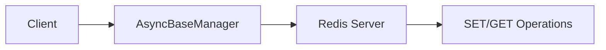

# 01 Basic Initialization

Quickly understand if this example fits your needs.



## What it does

Creates an `AsyncBaseManager` instance with default parameters and verifies the connection with a simple SET/GET operation.

## When to use it

- When you need to quickly test Redis connectivity
- When starting a new async project with Redis
- When you want a minimal working example to build upon

## Code

```python
"""01 - Basic Initialization of AsyncBaseManager

This example shows how to create an AsyncBaseManager instance
with default parameters and verify the connection.
"""

import asyncio

import redis.asyncio
from wredis._async_base import AsyncBaseManager


async def main():
    # Create a real Redis client
    client = redis.asyncio.Redis(host="localhost", port=6379, db=0, decode_responses=True)

    # Create a manager with default configuration
    # Inject the Redis client
    manager = AsyncBaseManager(verbose=True)
    manager.redis_client = client

    # Verify the connection is active
    is_alive = await manager.health_check()
    print(f"Redis connected: {is_alive}")

    # Perform a simple operation to confirm
    result = await manager._execute("set", "greeting", "hello world")
    print(f"SET result: {result}")

    value = await manager._execute("get", "greeting")
    print(f"GET result: {value}")

    # Close the connection when done
    await manager.close()
    await client.aclose()
    print("Connection closed successfully")


if __name__ == "__main__":
    asyncio.run(main())
```

## Run it

```bash
# Make sure Redis is running
redis-server

# Run the example
python example.py
```

## Expected output

```
Redis connected: True
SET result: True
GET result: hello world
Connection closed successfully
```
