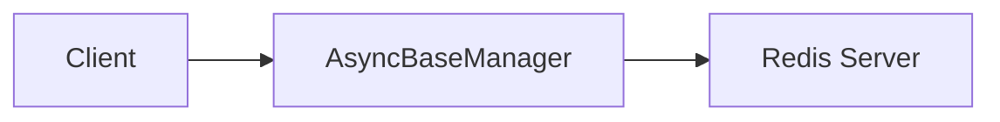

# 02 Health Check

Quickly understand if this example fits your needs.



## What it does

Demonstrates how to verify that the Redis connection is active and working correctly using the `health_check()` method, including error handling.

## When to use it

- Before critical operations to ensure Redis is available
- Monitoring application health
- Connection diagnostics

## Code

```python
# Copy and adapt to your needs
"""02 - Health check

This example demonstrates the use of the health_check() method to
verify that the Redis connection is active and working correctly,
including error handling.
"""

import asyncio

import redis.asyncio
from wredis._async_base import AsyncBaseManager
from wredis._exceptions import OperationError


async def main():
    # Create a real Redis client
    client = redis.asyncio.Redis(host="localhost", port=6379, db=0, decode_responses=True)

    # Create the manager with verbose to see logs
    manager = AsyncBaseManager(verbose=True)
    manager.redis_client = client

    # Perform health check - returns True if Redis responds
    try:
        status = await manager.health_check()
        print(f"Connection status: {status}")
    except OperationError as e:
        print(f"Health check error: {e}")

    # Health check can also be used before critical operations
    if await manager.health_check():
        print("Connection verified, proceeding with operations")
        await manager._execute("set", "status", "operational")
        value = await manager._execute("get", "status")
        print(f"Stored value: {value}")
    else:
        print("Connection not available")

    await manager.close()
    await client.aclose()
    print("Connection closed")


if __name__ == "__main__":
    asyncio.run(main())
```

## Run it

```bash
python example.py
```

## Expected output

```
Connection status: True
Connection verified, proceeding with operations
Stored value: operational
Connection closed
```
