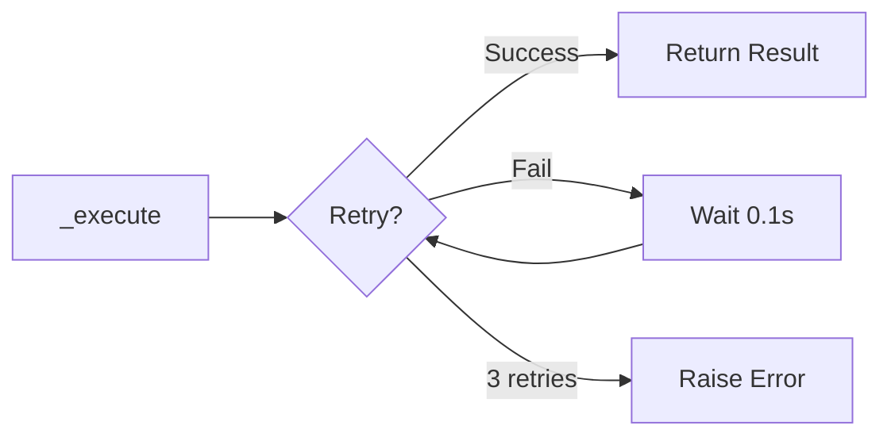

# 04 Execute with Retry

Quickly understand if this example fits your needs.



## What it does

Demonstrates the `_execute()` method that runs Redis operations with automatic exponential retry logic (up to 3 attempts) on connection failures.

## When to use it

- Handling transient connection failures
- Improving reliability of Redis operations
- Network instability scenarios

## Code

```python
# Copy and adapt to your needs
"""04 - Execution with retry (_execute)

This example demonstrates the _execute() method that runs Redis
operations with exponential retry logic (up to 3 attempts) on
connection failures.
"""

import asyncio

import redis.asyncio
from wredis._async_base import AsyncBaseManager


async def main():
    # Create a real Redis client
    client = redis.asyncio.Redis(host="localhost", port=6379, db=0, decode_responses=True)

    async with AsyncBaseManager(verbose=True) as manager:
        # Inject the Redis client
        manager.redis_client = client

        # _execute will automatically retry up to 3 times with exponential backoff
        # Delays are: 0.1s, 0.2s before each retry

        # SET operation with automatic retry
        result_set = await manager._execute("set", "user:1:name", "Ana")
        print(f"SET user:1:name = {result_set}")

        # GET operation with automatic retry
        name = await manager._execute("get", "user:1:name")
        print(f"GET user:1:name = {name}")

        # Operations with expiration
        await manager._execute("set", "token:abc123", "secret", ex=300)
        ttl = await manager._execute("ttl", "token:abc123")
        print(f"Token TTL: {ttl} seconds")

        # Check existence
        exists = await manager._execute("exists", "user:1:name")
        print(f"Does user:1:name exist? {bool(exists)}")

        # Delete key
        deleted = await manager._execute("delete", "user:1:name")
        print(f"Keys deleted: {deleted}")

    await client.aclose()
    print("Operations with retry completed")


if __name__ == "__main__":
    asyncio.run(main())
```

## Run it

```bash
python example.py
```

## Expected output

```
SET user:1:name = True
GET user:1:name = Ana
Token TTL: 300 seconds
Does user:1:name exist? True
Keys deleted: 1
Operations with retry completed
```