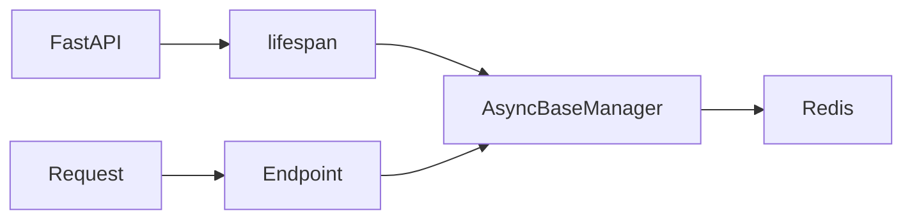

# 05 FastAPI Integration

Quickly understand if this example fits your needs.



## What it does

Shows how to integrate `AsyncBaseManager` with FastAPI using a startup/shutdown lifecycle to manage Redis connections for async endpoints.

## When to use it

- Building FastAPI applications with Redis
- REST APIs needing Redis backend
- Web services requiring cached data

## Code

```python
# Copy and adapt to your needs
"""05 - FastAPI integration

This example shows how to integrate AsyncBaseManager with FastAPI
to create endpoints that interact with Redis asynchronously.
Uses a startup/shutdown lifecycle to manage the connection.
"""

import asyncio
from contextlib import asynccontextmanager
from typing import Any, Dict

import redis.asyncio
from wredis._async_base import AsyncBaseManager

# Global variable for the Redis manager
redis_manager: AsyncBaseManager | None = None


@asynccontextmanager
async def lifespan(app: Dict[str, Any]):
    """Manages the FastAPI application lifecycle."""
    global redis_manager
    # Create a real Redis client
    client = redis.asyncio.Redis(host="localhost", port=6379, db=0, decode_responses=True)
    # On startup: create the connection
    redis_manager = AsyncBaseManager(verbose=False)
    redis_manager.redis_client = client
    connected = await redis_manager.health_check()
    print(f"FastAPI startup - Redis connected: {connected}")
    yield
    # On shutdown: release the connection
    if redis_manager:
        await redis_manager.close()
        await client.aclose()
        print("FastAPI shutdown - Redis disconnected")


# Simulated FastAPI app without needing the framework installed
async def simulate_fastapi():
    """Simulates FastAPI behavior for demonstration."""
    global redis_manager

    app = {"name": "my_api"}

    # Simulate startup
    async with lifespan(app):
        # Endpoint GET /health
        print("\n--- GET /health ---")
        status = await redis_manager.health_check()  # type: ignore[union-attr]
        print(f'{{"status": "healthy", "redis": {status}}}')

        # Endpoint POST /cache
        print("\n--- POST /cache ---")
        await redis_manager._execute("set", "cache:page:home", "HTML content")  # type: ignore[union-attr]
        print('{"action": "cached", "key": "cache:page:home"}')

        # Endpoint GET /cache/{key}
        print("\n--- GET /cache/cache:page:home ---")
        content = await redis_manager._execute("get", "cache:page:home")  # type: ignore[union-attr]
        print(f'{{"key": "cache:page:home", "value": "{content}"}}')

        # Endpoint DELETE /cache/{key}
        print("\n--- DELETE /cache/cache:page:home ---")
        await redis_manager._execute("delete", "cache:page:home")  # type: ignore[union-attr]
        print('{"action": "deleted", "key": "cache:page:home"}')

    print("\nSimulated FastAPI completed")


async def main():
    await simulate_fastapi()


if __name__ == "__main__":
    asyncio.run(main())
```

## Run it

```bash
python example.py
```

## Expected output

```
FastAPI startup - Redis connected: True

--- GET /health ---
{"status": "healthy", "redis": True}

--- POST /cache ---
{"action": "cached", "key": "cache:page:home"}

--- GET /cache/cache:page:home ---
{"key": "cache:page:home", "value": "HTML content"}

--- DELETE /cache/cache:page:home ---
{"action": "deleted", "key": "cache:page:home"}

FastAPI shutdown - Redis disconnected

Simulated FastAPI completed
```
