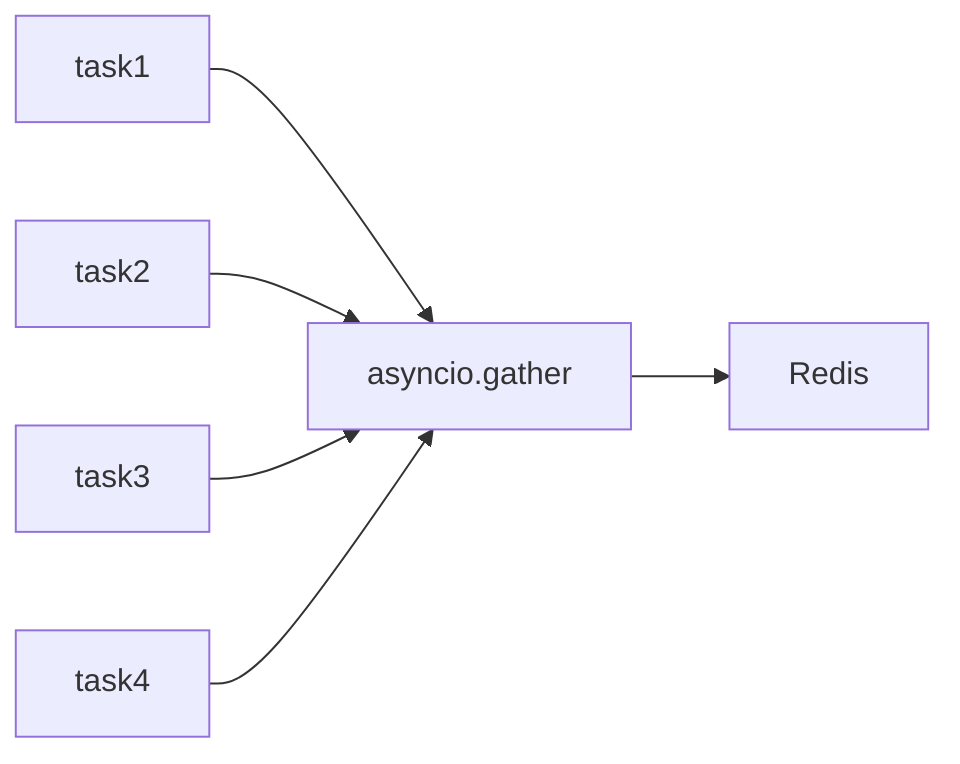

# 06 Concurrent Operations

Quickly understand if this example fits your needs.



## What it does

Demonstrates how to execute multiple Redis operations concurrently using `asyncio.gather()` to maximize performance on independent operations.

## When to use it

- Batch operations on multiple keys
- Improving throughput for independent operations
- Parallel data processing

## Code

```python
# Copy and adapt to your needs
"""06 - Concurrent operations

This example demonstrates how to execute multiple Redis operations
concurrently using asyncio.gather() to maximize performance on
independent operations.
"""

import asyncio

import redis.asyncio
from wredis._async_base import AsyncBaseManager


async def write_data(manager: AsyncBaseManager, key: str, value: str):
    """Writes data to Redis asynchronously."""
    await manager._execute("set", key, value)
    return f"Written: {key}={value}"


async def read_data(manager: AsyncBaseManager, key: str):
    """Reads data from Redis asynchronously."""
    value = await manager._execute("get", key)
    return f"Read: {key}={value}"


async def main():
    # Create a real Redis client
    client = redis.asyncio.Redis(host="localhost", port=6379, db=0, decode_responses=True)

    async with AsyncBaseManager(verbose=False) as manager:
        manager.redis_client = client

        # Concurrent write of multiple keys
        print("=== Concurrent Write ===")
        write_tasks = [write_data(manager, f"user:{i}", f"name_{i}") for i in range(1, 6)]
        results = await asyncio.gather(*write_tasks)
        for r in results:
            print(f"  {r}")

        # Concurrent read of multiple keys
        print("\n=== Concurrent Read ===")
        read_tasks = [read_data(manager, f"user:{i}") for i in range(1, 6)]
        results = await asyncio.gather(*read_tasks)
        for r in results:
            print(f"  {r}")

        # Concurrent mixed operations
        print("\n=== Concurrent Mixed Operations ===")
        mixed = [
            manager._execute("set", "temp", "data"),
            manager._execute("get", "user:1"),
            manager._execute("exists", "user:3"),
            manager._execute("ttl", "user:5"),
        ]
        mixed_results = await asyncio.gather(*mixed)
        print(f"  SET temp: {mixed_results[0]}")
        print(f"  GET user:1: {mixed_results[1]}")
        print(f"  EXISTS user:3: {bool(mixed_results[2])}")
        print(f"  TTL user:5: {mixed_results[3]}")

    await client.aclose()
    print("\nConcurrent operations completed")


if __name__ == "__main__":
    asyncio.run(main())
```

## Run it

```bash
python example.py
```

## Expected output

```
=== Concurrent Write ===
  Written: user:1=name_1
  Written: user:2=name_2
  Written: user:3=name_3
  Written: user:4=name_4
  Written: user:5=name_5

=== Concurrent Read ===
  Read: user:1=name_1
  Read: user:2=name_2
  Read: user:3=name_3
  Read: user:4=name_4
  Read: user:5=name_5

=== Concurrent Mixed Operations ===
  SET temp: True
  GET user:1: name_1
  EXISTS user:3: True
  TTL user:5: -1

Concurrent operations completed
```
