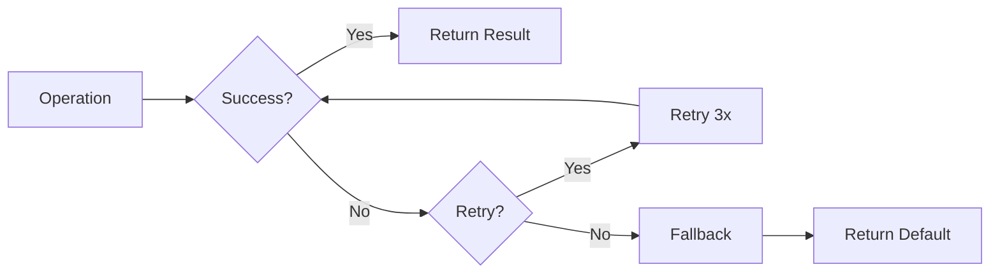

# 08 Error Handling

Quickly understand if this example fits your needs.



## What it does

Demonstrates error handling strategies when using `AsyncBaseManager`, including catching `OperationError`, automatic retries, and graceful degradation.

## When to use it

- Handling Redis connection failures
- Implementing fallback strategies
- Building resilient applications

## Code

```python
# Copy and adapt to your needs
"""08 - Error handling

This example demonstrates error handling strategies when using
AsyncBaseManager, including catching OperationError, automatic
retries and graceful degradation.
"""

import asyncio

import redis.asyncio
from wredis._async_base import AsyncBaseManager
from wredis._exceptions import OperationError


async def main():
    # Create a real Redis client
    client = redis.asyncio.Redis(host="localhost", port=6379, db=0, decode_responses=True)

    async with AsyncBaseManager(verbose=True) as manager:
        manager.redis_client = client

        # 1. Error handling in health check
        print("=== 1. Health check with try/except ===")
        try:
            status = await manager.health_check()
            print(f"  Health check successful: {status}")
        except OperationError as e:
            print(f"  Connection error: {e}")

        # 2. Error handling in operations
        print("\n=== 2. Operation with try/except ===")
        try:
            # Valid operation
            await manager._execute("set", "secure:data", "valid_value")
            result = await manager._execute("get", "secure:data")
            print(f"  Operation successful: {result}")
        except OperationError as e:
            print(f"  Operation error: {e}")

        # 3. Operation with invalid arguments
        print("\n=== 3. Operation with invalid arguments ===")
        try:
            # This will fail because 'get' does not accept multiple positional arguments
            await manager._execute("get", "key1", "key2")
        except (OperationError, Exception) as e:
            print(f"  Error caught: {type(e).__name__}: {e}")

        # 4. Graceful degradation - fallback when Redis fails
        print("\n=== 4. Graceful degradation ===")
        cache_key = "config:app"
        try:
            cached_value = await manager._execute("get", cache_key)
            if cached_value:
                config = cached_value
            else:
                # Simulate loading from database
                config = "default_configuration"
                await manager._execute("set", cache_key, config, ex=60)
            print(f"  Configuration obtained: {config}")
        except OperationError:
            # Fallback if Redis is not available
            config = "fallback_configuration"
            print(f"  Using fallback: {config}")

        # 5. Automatic retry (already integrated in _execute)
        print("\n=== 5. Automatic retry ===")
        print("  _execute automatically retries up to 3 times")
        print("  with exponential backoff: 0.1s, 0.2s")
        await manager._execute("set", "retry:key", "safe_value")
        print(f"  Operation completed with retries enabled")

    await client.aclose()
    print("\nError handling completed")


if __name__ == "__main__":
    asyncio.run(main())
```

## Run it

```bash
python example.py
```

## Expected output

```
=== 1. Health check with try/except ===
  Health check successful: True

=== 2. Operation with try/except ===
  Operation successful: valid_value

=== 3. Operation with invalid arguments ===
  Error caught: OperationError: ...

=== 4. Graceful degradation ===
  Configuration obtained: default_configuration

=== 5. Automatic retry ===
  _execute automatically retries up to 3 times
  with exponential backoff: 0.1s, 0.2s
  Operation completed with retries enabled

Error handling completed
```