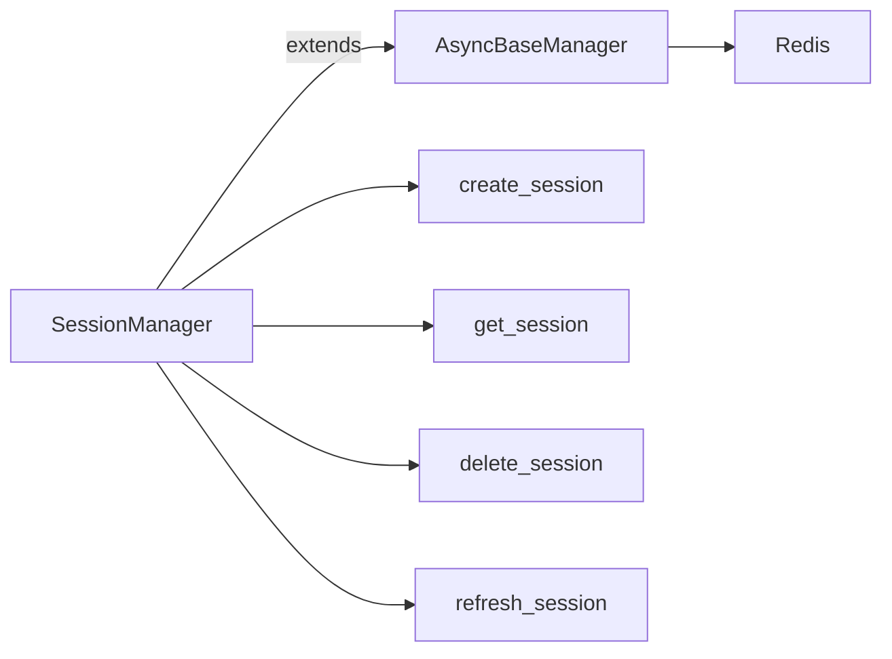

# 09 Custom Async Manager

Quickly understand if this example fits your needs.



## What it does

Shows how to create a custom manager by inheriting from `AsyncBaseManager`, adding specific methods for particular use cases like user session management.

## When to use it

- Building domain-specific managers
- Encapsulating business logic
- Creating reusable Redis abstractions

## Code

```python
# Copy and adapt to your needs
"""09 - Custom manager with inheritance

This example shows how to create a custom manager by inheriting
from AsyncBaseManager, adding specific methods for particular
use cases like user session management.
"""

import asyncio
import json
from typing import Any

import redis.asyncio
from wredis._async_base import AsyncBaseManager


class SessionManager(AsyncBaseManager):
    """Custom manager for user session management."""

    def __init__(self, session_ttl: int = 3600, **kwargs: Any):
        """Initializes the SessionManager.

        Args:
            session_ttl: Session time-to-live in seconds.
            **kwargs: Arguments for AsyncBaseManager.
        """
        super().__init__(**kwargs)
        self.session_ttl = session_ttl
        self.prefix = "session"

    async def create_session(self, user_id: str, data: dict) -> str:
        """Creates a new session for a user."""
        session_key = f"{self.prefix}:{user_id}"
        await self._execute("set", session_key, json.dumps(data), ex=self.session_ttl)
        self.log(f"Session created for user {user_id}")
        return session_key

    async def get_session(self, user_id: str) -> dict | None:
        """Gets the data of an existing session."""
        session_key = f"{self.prefix}:{user_id}"
        data = await self._execute("get", session_key)
        if data:
            return json.loads(data)
        return None

    async def delete_session(self, user_id: str) -> bool:
        """Deletes a user session."""
        session_key = f"{self.prefix}:{user_id}"
        deleted = await self._execute("delete", session_key)
        self.log(f"Session deleted for user {user_id}")
        return bool(deleted)

    async def refresh_session(self, user_id: str) -> bool:
        """Refreshes the TTL of an existing session."""
        session_key = f"{self.prefix}:{user_id}"
        refreshed = await self._execute("expire", session_key, self.session_ttl)
        return bool(refreshed)


async def main():
    # Create a real Redis client
    client = redis.asyncio.Redis(host="localhost", port=6379, db=0, decode_responses=True)

    async with SessionManager(
        decode_responses=True,
        session_ttl=1800,  # 30 minutes
        verbose=True,
    ) as session_mgr:
        # Inject the Redis client
        session_mgr.redis_client = client

        # Verify connection
        connected = await session_mgr.health_check()
        print(f"SessionManager connected: {connected}")

        # Create a session
        print("\n=== Create session ===")
        user_data = {
            "name": "Carlos",
            "role": "admin",
            "last_activity": "2026-04-03T10:00:00",
        }
        key = await session_mgr.create_session("user_42", user_data)
        print(f"Session created: {key}")

        # Get the session
        print("\n=== Get session ===")
        session = await session_mgr.get_session("user_42")
        print(f"Session data: {session}")

        # Refresh the session
        print("\n=== Refresh session ===")
        refreshed = await session_mgr.refresh_session("user_42")
        print(f"Session refreshed: {refreshed}")

        # Delete the session
        print("\n=== Delete session ===")
        deleted = await session_mgr.delete_session("user_42")
        print(f"Session deleted: {deleted}")

        # Verify it no longer exists
        session = await session_mgr.get_session("user_42")
        print(f"Session after deletion: {session}")

    await client.aclose()
    print("\nCustom manager completed")


if __name__ == "__main__":
    asyncio.run(main())
```

## Run it

```bash
python example.py
```

## Expected output

```
SessionManager connected: True

=== Create session ===
Session created: session:user_42

=== Get session ===
Session data: {'name': 'Carlos', 'role': 'admin', 'last_activity': '2026-04-03T10:00:00'}

=== Refresh session ===
Session refreshed: True

=== Delete session ===
Session deleted: True

Session after deletion: None

Custom manager completed
```