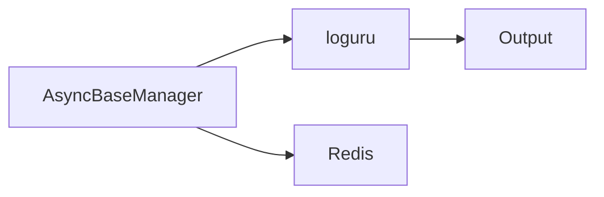

# 10 Logging Integration

Quickly understand if this example fits your needs.



## What it does

Shows the use of the `log()` method from `AsyncBaseManager` to log messages with different severity levels integrated with loguru.

## When to use it

- Application monitoring
- Debugging Redis operations
- Audit trails for data access

## Code

```python
# Copy and adapt to your needs
"""10 - Integrated logging system

This example shows the use of the log() method from AsyncBaseManager
to log messages with different severity levels integrated with loguru.
"""

import asyncio

import redis.asyncio
from wredis._async_base import AsyncBaseManager


async def main():
    # Create a real Redis client
    client = redis.asyncio.Redis(host="localhost", port=6379, db=0, decode_responses=True)

    async with AsyncBaseManager(verbose=True) as manager:
        manager.redis_client = client

        # Verify connection
        connected = await manager.health_check()
        print(f"Connection established: {connected}")

        # Use the integrated logging system
        print("\n=== Log messages ===")
        manager.log("Application started successfully", "info")
        manager.log("Processing user data", "debug")
        manager.log("Warning: cache almost full", "warning")

        # Perform operations with logging
        print("\n=== Operations with logging ===")
        await manager._execute("set", "app:status", "running")
        manager.log("Application status updated", "info")

        status = await manager._execute("get", "app:status")
        print(f"Current status: {status}")

        # Simulate an error scenario
        manager.log("Attempting critical operation...", "info")
        try:
            await manager._execute("set", "app:data", '{"items": [1, 2, 3]}')
            manager.log("Critical data saved successfully", "info")
        except Exception as e:
            manager.log(f"Error saving data: {e}", "error")

        # Log completion
        manager.log("Process completed without errors", "info")

    await client.aclose()
    print("\nLogging system completed")


if __name__ == "__main__":
    asyncio.run(main())
```

## Run it

```bash
python example.py
```

## Expected output

```
Connection established: True

=== Log messages ===
[INFO] Application started successfully
[DEBUG] Processing user data
[WARNING] Warning: cache almost full

=== Operations with logging ===
Current status: running
[INFO] Application status updated
[INFO] Process completed without errors

Logging system completed
```
