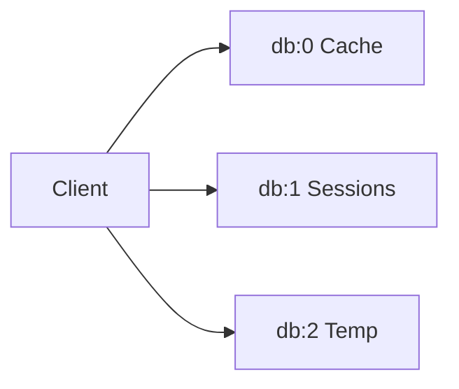

# 11 Multiple Databases

Quickly understand if this example fits your needs.



## What it does

Demonstrates how to connect and operate on multiple Redis databases (db=0, db=1, db=2) using separate instances of `AsyncBaseManager`.

## When to use it

- Separating cache, sessions, and temporary data
- Isolation between different data types
- Multi-tenant applications

## Code

```python
# Copy and adapt to your needs
"""11 - Multiple databases

This example demonstrates how to connect and operate on multiple
Redis databases (db=0, db=1, db=2) using separate instances
of AsyncBaseManager.
"""

import asyncio

import redis.asyncio
from wredis._async_base import AsyncBaseManager


async def main():
    # Create a real Redis client for each database
    client0 = redis.asyncio.Redis(host="localhost", port=6379, db=0, decode_responses=True)
    client1 = redis.asyncio.Redis(host="localhost", port=6379, db=1, decode_responses=True)
    client2 = redis.asyncio.Redis(host="localhost", port=6379, db=2, decode_responses=True)

    # Create managers for different databases
    db_cache = AsyncBaseManager(decode_responses=True, verbose=False)
    db_sessions = AsyncBaseManager(decode_responses=True, verbose=False)
    db_temp = AsyncBaseManager(decode_responses=True, verbose=False)

    # Inject Redis clients into each manager
    db_cache.redis_client = client0
    db_sessions.redis_client = client1
    db_temp.redis_client = client2

    try:
        # Verify all connections
        print("=== Verifying connections ===")
        for name, mgr in [
            ("Cache (db=0)", db_cache),
            ("Sessions (db=1)", db_sessions),
            ("Temp (db=2)", db_temp),
        ]:
            status = await mgr.health_check()
            print(f"  {name}: {status}")

        # Write data to each database
        print("\n=== Writing to db=0 (Cache) ===")
        await db_cache._execute("set", "cache:page:home", "<html>...</html>")
        await db_cache._execute("set", "cache:page:about", "<html>about</html>")
        value = await db_cache._execute("get", "cache:page:home")
        print(f"  cache:page:home = {value}")

        print("\n=== Writing to db=1 (Sessions) ===")
        await db_sessions._execute("set", "session:abc123", '{"user": "admin"}')
        await db_sessions._execute("set", "session:def456", '{"user": "editor"}')
        value = await db_sessions._execute("get", "session:abc123")
        print(f"  session:abc123 = {value}")

        print("\n=== Writing to db=2 (Temp) ===")
        await db_temp._execute("set", "temp:job:001", "processing", ex=60)
        await db_temp._execute("set", "temp:job:002", "pending", ex=120)
        value = await db_temp._execute("get", "temp:job:001")
        ttl = await db_temp._execute("ttl", "temp:job:001")
        print(f"  temp:job:001 = {value} (TTL: {ttl}s)")

        # Verify isolation between databases
        print("\n=== Verifying isolation ===")
        data_in_db0 = await db_cache._execute("get", "session:abc123")
        data_in_db1 = await db_sessions._execute("get", "cache:page:home")
        print(f"  session:abc123 in db=0: {data_in_db0} (should be None)")
        print(f"  cache:page:home in db=1: {data_in_db1} (should be None)")

    finally:
        # Close all connections
        await db_cache.close()
        await db_sessions.close()
        await db_temp.close()
        await client0.aclose()
        await client1.aclose()
        await client2.aclose()
        print("\nAll connections closed")


if __name__ == "__main__":
    asyncio.run(main())
```

## Run it

```bash
python example.py
```

## Expected output

```
=== Verifying connections ===
  Cache (db=0): True
  Sessions (db=1): True
  Temp (db=2): True

=== Writing to db=0 (Cache) ===
  cache:page:home = <html>...</html>

=== Writing to db=1 (Sessions) ===
  session:abc123 = {"user": "admin"}

=== Writing to db=2 (Temp) ===
  temp:job:001 = processing (TTL: 60s)

=== Verifying isolation ===
  session:abc123 in db=0: None (should be None)
  cache:page:home in db=1: None (should be None)

All connections closed
```