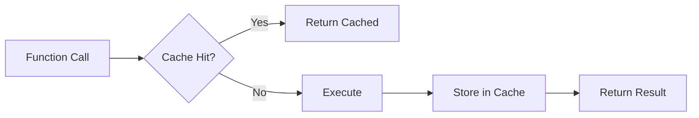

# 13 Async Cache Decorator

Quickly understand if this example fits your needs.



## What it does

Implements a custom decorator that uses `AsyncBaseManager` to cache results of async functions, avoiding redundant executions with configurable TTL.

## When to use it

- Caching expensive function calls
- Reducing API calls to external services
- Improving response times for repeated queries

## Code

```python
# Copy and adapt to your needs
"""13 - Async cache decorator

This example implements a custom decorator that uses
AsyncBaseManager to cache results of async functions,
avoiding redundant executions with configurable TTL.
"""

import asyncio
import functools
from typing import Any, Callable

import redis.asyncio
from wredis._async_base import AsyncBaseManager

# Global shared manager for the decorator
_cache_manager: AsyncBaseManager | None = None


def async_cache(ttl: int = 300, prefix: str = "cache"):
    """Decorator to cache results of async functions.

    Args:
        ttl: Cache time-to-live in seconds.
        prefix: Prefix for cache keys.
    """

    def decorator(func: Callable):
        @functools.wraps(func)
        async def wrapper(*args: Any, **kwargs: Any):
            global _cache_manager
            if _cache_manager is None:
                raise RuntimeError("Cache manager not initialized")

            # Generate a unique key based on arguments
            key_args = "_".join(str(a) for a in args)
            key_kwargs = "_".join(f"{k}={v}" for k, v in sorted(kwargs.items()))
            cache_key = f"{prefix}:{func.__name__}:{key_args}:{key_kwargs}"

            # Try to get from cache
            cached_result = await _cache_manager._execute("get", cache_key)
            if cached_result is not None:
                print(f"  [CACHE HIT] {cache_key}")
                return cached_result

            # Execute the function
            print(f"  [CACHE MISS] {cache_key} - executing function")
            result = await func(*args, **kwargs)

            # Store in cache
            await _cache_manager._execute("set", cache_key, str(result), ex=ttl)
            return result

        return wrapper

    return decorator


# Simulated expensive function
@async_cache(ttl=60, prefix="app")
async def calculate_statistics(report_id: int):
    """Simulates an expensive calculation that benefits from caching."""
    await asyncio.sleep(0.1)  # Simulate processing
    return f"statistics_of_report_{report_id}"


async def main():
    global _cache_manager

    # Create a real Redis client
    client = redis.asyncio.Redis(host="localhost", port=6379, db=0, decode_responses=True)

    async with AsyncBaseManager(verbose=False) as manager:
        manager.redis_client = client
        _cache_manager = manager

        print("=== First call (CACHE MISS) ===")
        result1 = await calculate_statistics(42)
        print(f"  Result: {result1}")

        print("\n=== Second identical call (CACHE HIT) ===")
        result2 = await calculate_statistics(42)
        print(f"  Result: {result2}")

        print("\n=== Third call with different args (CACHE MISS) ===")
        result3 = await calculate_statistics(99)
        print(f"  Result: {result3}")

        print("\n=== Fourth call same as first (CACHE HIT) ===")
        result4 = await calculate_statistics(42)
        print(f"  Result: {result4}")

        # Verify cache keys
        print("\n=== Keys in cache ===")
        keys = await manager._execute("keys", "app:*")
        for key in sorted(keys):
            value = await manager._execute("get", key)
            ttl = await manager._execute("ttl", key)
            print(f"  {key} = {value} (TTL: {ttl}s)")

    _cache_manager = None
    await client.aclose()
    print("\nCache decorator completed")


if __name__ == "__main__":
    asyncio.run(main())
```

## Run it

```bash
python example.py
```

## Expected output

```
=== First call (CACHE MISS) ===
  [CACHE MISS] app:calculate_statistics:42: - executing function
  Result: statistics_of_report_42

=== Second identical call (CACHE HIT) ===
  [CACHE HIT] app:calculate_statistics:42:
  Result: statistics_of_report_42

=== Third call with different args (CACHE MISS) ===
  [CACHE MISS] app:calculate_statistics:99: - executing function
  Result: statistics_of_report_99

=== Fourth call same as first (CACHE HIT) ===
  [CACHE HIT] app:calculate_statistics:42:
  Result: statistics_of_report_42

=== Keys in cache ===
  app:calculate_statistics:42: = statistics_of_report_42 (TTL: 60s)
  app:calculate_statistics:99: = statistics_of_report_99 (TTL: 60s)

Cache decorator completed
```
