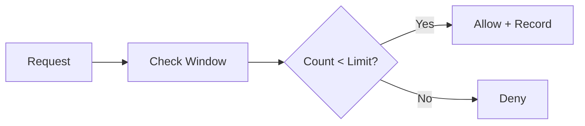

# 14 Rate Limiter

Quickly understand if this example fits your needs.



## What it does

Implements a rate limiter using Redis with the sliding window log algorithm, leveraging `AsyncBaseManager`'s async operations.

## When to use it

- API request throttling
- Protecting against abuse
- Usage-based quota management

## Code

```python
# Copy and adapt to your needs
"""14 - Async rate limiter

This example implements a rate limiter using Redis with the
sliding window log algorithm, leveraging AsyncBaseManager's
async operations.
"""

import asyncio
import time
from typing import Any

import redis.asyncio
from wredis._async_base import AsyncBaseManager


class RateLimiter:
    """Rate limiter using Redis with sliding window log."""

    def __init__(self, manager: AsyncBaseManager, max_requests: int, window_seconds: int):
        """Initializes the rate limiter.

        Args:
            manager: AsyncBaseManager instance.
            max_requests: Maximum number of requests allowed.
            window_seconds: Time window in seconds.
        """
        self.manager = manager
        self.max_requests = max_requests
        self.window_seconds = window_seconds

    async def is_allowed(self, client_id: str) -> tuple[bool, dict[str, Any]]:
        """Checks if a request is allowed.

        Args:
            client_id: Unique client identifier.

        Returns:
            Tuple with (allowed, limiter_info).
        """
        key = f"ratelimit:{client_id}"
        now = time.time()
        window_start = now - self.window_seconds

        # Remove entries outside the window
        await self.manager._execute("zremrangebyscore", key, 0, window_start)

        # Count requests in current window
        count = await self.manager._execute("zcard", key)

        if count < self.max_requests:
            # Request allowed - register timestamp
            await self.manager._execute("zadd", key, {str(now): now})
            await self.manager._execute("expire", key, self.window_seconds)
            return True, {
                "allowed": True,
                "requests_used": count + 1,
                "requests_remaining": self.max_requests - count - 1,
                "window_seconds": self.window_seconds,
            }
        else:
            # Request denied
            return False, {
                "allowed": False,
                "requests_used": count,
                "requests_remaining": 0,
                "window_seconds": self.window_seconds,
            }


async def main():
    # Create a real Redis client
    client = redis.asyncio.Redis(host="localhost", port=6379, db=0, decode_responses=True)

    async with AsyncBaseManager(verbose=False) as manager:
        manager.redis_client = client

        # Create a rate limiter: 5 requests per 10 second window
        limiter = RateLimiter(manager, max_requests=5, window_seconds=10)

        print("=== Rate Limiter - 5 requests / 10 seconds ===\n")

        # Simulate 8 requests from a client
        client_id = "user_123"
        for i in range(8):
            allowed, info = await limiter.is_allowed(client_id)
            status = "ALLOWED" if allowed else "DENIED"
            print(
                f"  Request {i + 1}: {status} | "
                f"Used: {info['requests_used']}/{5} | "
                f"Remaining: {info['requests_remaining']}"
            )

        # Verify entries in Redis
        print("\n=== State in Redis ===")
        key = f"ratelimit:{client_id}"
        entries = await manager._execute("zrange", key, 0, -1, "WITHSCORES")
        print(f"  Entries in sorted set: {len(entries) // 2}")
        ttl = await manager._execute("ttl", key)
        print(f"  Remaining TTL: {ttl}s")

        # Try with another client (should have its own limit)
        print("\n=== Another client (independent limit) ===")
        client_id_2 = "user_456"
        allowed, info = await limiter.is_allowed(client_id_2)
        status = "ALLOWED" if allowed else "DENIED"
        print(f"  Request 1 of user_456: {status}")

    await client.aclose()
    print("\nRate Limiter completed")


if __name__ == "__main__":
    asyncio.run(main())
```

## Run it

```bash
python example.py
```

## Expected output

```
=== Rate Limiter - 5 requests / 10 seconds ===

  Request 1: ALLOWED | Used: 1/5 | Remaining: 4
  Request 2: ALLOWED | Used: 2/5 | Remaining: 3
  Request 3: ALLOWED | Used: 3/5 | Remaining: 2
  Request 4: ALLOWED | Used: 4/5 | Remaining: 1
  Request 5: ALLOWED | Used: 5/5 | Remaining: 0
  Request 6: DENIED | Used: 5/5 | Remaining: 0
  Request 7: DENIED | Used: 5/5 | Remaining: 0
  Request 8: DENIED | Used: 5/5 | Remaining: 0

=== State in Redis ===
  Entries in sorted set: 5
  Remaining TTL: 10s

=== Another client (independent limit) ===
  Request 1 of user_456: ALLOWED

Rate Limiter completed
```
