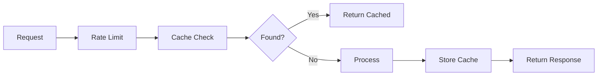

# 15 FastAPI Advanced Integration

Quickly understand if this example fits your needs.



## What it does

Shows a complete FastAPI integration with rate limiting middleware, response caching, and session management, all managed by `AsyncBaseManager`.

## When to use it

- Production FastAPI applications
- Building APIs with multiple middleware layers
- Comprehensive Redis-backed web services

## Code

```python
# Copy and adapt to your needs
"""15 - Complete FastAPI integration (advanced)

This example shows a more complete integration with FastAPI,
including rate limiting middleware, response caching and
session management, all managed by AsyncBaseManager.
"""

import asyncio
import json
import time
from contextlib import asynccontextmanager
from typing import Any, Dict

import redis.asyncio
from wredis._async_base import AsyncBaseManager

# Global manager instance
redis_manager: AsyncBaseManager | None = None
_redis_client: Any = None


# --- Simulated FastAPI components ---


class SimulatedRequest:
    """Simulates an HTTP request."""

    def __init__(self, method: str, path: str, client_ip: str):
        self.method = method
        self.path = path
        self.client_ip = client_ip


async def rate_limit_middleware(request: SimulatedRequest) -> dict | None:
    """Rate limiting middleware."""
    global redis_manager
    if redis_manager is None:
        return None

    key = f"ratelimit:{request.client_ip}"
    now = time.time()
    window = 60
    max_req = 10

    await redis_manager._execute("zremrangebyscore", key, 0, now - window)
    count = await redis_manager._execute("zcard", key)

    if count >= max_req:
        return {"status": 429, "body": {"error": "Too many requests"}}

    await redis_manager._execute("zadd", key, {str(now): now})
    await redis_manager._execute("expire", key, window)
    return None


async def cache_middleware(request: SimulatedRequest) -> dict | None:
    """Cache middleware for GET requests."""
    global redis_manager
    if redis_manager is None or request.method != "GET":
        return None

    cache_key = f"cache:{request.method}:{request.path}"
    cached = await redis_manager._execute("get", cache_key)
    if cached:
        return {"status": 200, "body": json.loads(cached), "cached": True}
    return None


async def store_cache(request: SimulatedRequest, response: dict):
    """Stores response in cache."""
    global redis_manager
    if redis_manager is None or request.method != "GET":
        return

    cache_key = f"cache:{request.method}:{request.path}"
    await redis_manager._execute("set", cache_key, json.dumps(response), ex=120)


async def handle_request(request: SimulatedRequest) -> dict:
    """Simulates FastAPI handler with middleware."""
    # 1. Rate limiting
    rate_limit_response = await rate_limit_middleware(request)
    if rate_limit_response:
        return rate_limit_response

    # 2. Cache check
    cached_response = await cache_middleware(request)
    if cached_response:
        return cached_response

    # 3. Real processing (simulated)
    response_data = {
        "path": request.path,
        "timestamp": time.time(),
        "data": f"Content of {request.path}",
    }

    # 4. Store in cache
    await store_cache(request, response_data)

    return {"status": 200, "body": response_data, "cached": False}


@asynccontextmanager
async def app_lifespan():
    """Manages the application lifecycle."""
    global redis_manager, _redis_client
    _redis_client = redis.asyncio.Redis(host="localhost", port=6379, db=0, decode_responses=True)
    redis_manager = AsyncBaseManager(verbose=False)
    redis_manager.redis_client = _redis_client
    connected = await redis_manager.health_check()
    print(f"App startup - Redis: {'connected' if connected else 'failed'}")
    yield
    if redis_manager:
        await redis_manager.close()
        await _redis_client.aclose()
        print("App shutdown - Redis disconnected")


async def main():
    """Simulates the complete FastAPI flow with middleware."""
    async with app_lifespan():
        # Simulate several requests
        requests = [
            SimulatedRequest("GET", "/api/users", "192.168.1.100"),
            SimulatedRequest("GET", "/api/users", "192.168.1.100"),  # Should come from cache
            SimulatedRequest("POST", "/api/users", "192.168.1.100"),  # POST not cached
            SimulatedRequest("GET", "/api/products", "192.168.1.200"),  # Another client
            SimulatedRequest("GET", "/api/products", "192.168.1.200"),  # Should come from cache
        ]

        for i, req in enumerate(requests, 1):
            print(f"\n=== Request {i}: {req.method} {req.path} ({req.client_ip}) ===")
            response = await handle_request(req)

            if response.get("cached"):
                print(f"  [CACHE] Response from cache")
            else:
                print(f"  [NEW] Response generated")

            print(f"  Status: {response['status']}")
            body = response.get("body", {})
            if "error" in body:
                print(f"  Error: {body['error']}")
            elif "data" in body:
                print(f"  Data: {body['data']}")

        # State summary in Redis
        print("\n=== Redis state ===")
        keys = await redis_manager._execute("keys", "*")  # type: ignore[union-attr]
        print(f"  Active keys: {len(keys)}")
        for key in sorted(keys):
            ttl = await redis_manager._execute("ttl", key)  # type: ignore[union-attr]
            print(f"    {key} (TTL: {ttl}s)")

    print("\nAdvanced FastAPI integration completed")


if __name__ == "__main__":
    asyncio.run(main())
```

## Run it

```bash
python example.py
```

## Expected output

```
App startup - Redis: connected

=== Request 1: GET /api/users (192.168.1.100) ===
  [NEW] Response generated
  Status: 200
  Data: Content of /api/users

=== Request 2: GET /api/users (192.168.1.100) ===
  [CACHE] Response from cache
  Status: 200
  Data: Content of /api/users

=== Request 3: POST /api/users (192.168.1.100) ===
  [NEW] Response generated
  Status: 200
  Data: Content of /api/users

=== Request 4: GET /api/products (192.168.1.200) ===
  [NEW] Response generated
  Status: 200
  Data: Content of /api/products

=== Request 5: GET /api/products (192.168.1.200) ===
  [CACHE] Response from cache
  Status: 200
  Data: Content of /api/products

=== Redis state ===
  Active keys: 3
    cache:GET:/api/products (TTL: 120s)
    cache:GET:/api/users (TTL: 120s)
    ratelimit:192.168.1.100 (TTL: 60s)

App shutdown - Redis disconnected

Advanced FastAPI integration completed
```
