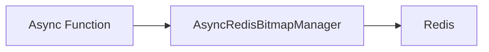

# Bitmap - Create

## Description
Demonstrates how to write bitmap data to Redis using async operations. Bitmaps are efficient space-saving data structures for storing binary information at specific offsets.

## Code

```python
"""Async Bitmap Example - Write"""

import asyncio
from wredis.async_api import AsyncRedisBitmapManager


async def main():
    manager = AsyncRedisBitmapManager(host="localhost")

    await manager.set_bit(key="my_bitmap", offset=5, value=1)
    await manager.set_bit(key="my_bitmap", offset=10, value=1, ttl=300)

    print("Bitmap operations completed")


if __name__ == "__main__":
    asyncio.run(main())
```

## Run

```bash
python example.py
```

## Diagram


