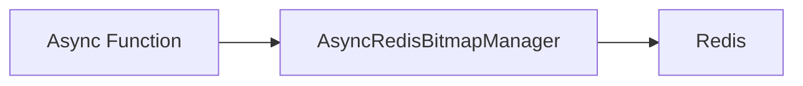

# Bitmap - Read

## Description
Demonstrates how to read bitmap data from Redis using async operations. Reads bit values, counts set bits, and retrieves TTL information.

## Code

```python
"""Async Bitmap Example - Read"""

import asyncio
from wredis.async_api import AsyncRedisBitmapManager


async def main():
    manager = AsyncRedisBitmapManager(host="localhost")

    bit_value = await manager.get_bit("my_bitmap", 0)
    bit_count = await manager.count_bits("my_bitmap")
    ttl = await manager.get_ttl("my_bitmap")

    print(f"Bit value: {bit_value}")
    print(f"Bit count: {bit_count}")
    print(f"TTL: {ttl}")


if __name__ == "__main__":
    asyncio.run(main())
```

## Run

```bash
python example.py
```

## Diagram

