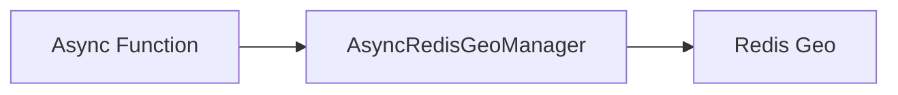

# Geo - Basic

## Description
Demonstrates adding geographic locations to Redis and calculating distances between them using the Geo API.

## Code

```python
import asyncio
from wredis.async_api import AsyncRedisGeoManager


async def main():
    geo = AsyncRedisGeoManager(host="localhost")
    await geo.add_location("cities", "new_york", -74.006, 40.7128)
    await geo.add_location("cities", "los_angeles", -118.2437, 34.0522)

    distance = await geo.get_distance("cities", "new_york", "los_angeles", unit="km")
    print(f"Distance: {distance} km")


if __name__ == "__main__":
    asyncio.run(main())
```

## Run

```bash
python example.py
```

## Diagram


