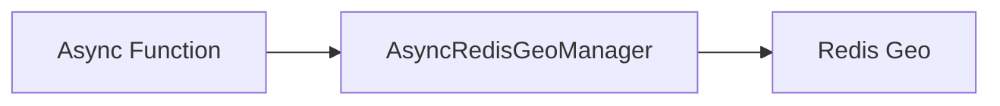

# Geo - Search

## Description
Demonstrates searching for locations within a radius using the Geo API. Finds nearby places based on coordinates.

## Code

```python
import asyncio
from wredis.async_api import AsyncRedisGeoManager


async def main():
    geo = AsyncRedisGeoManager(host="localhost")
    await geo.add_location("places", "store_a", -122.4194, 37.7749)
    await geo.add_location("places", "store_b", -122.4084, 37.7849)

    nearby = await geo.search_nearby("places", -122.4194, 37.7749, 1, unit="km")
    print(f"Nearby stores: {nearby}")


if __name__ == "__main__":
    asyncio.run(main())
```

## Run

```bash
python example.py
```

## Diagram


