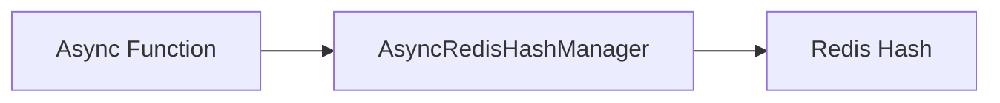

# Hash - Create

## Description
Demonstrates creating hash data structures in Redis using async operations. Hashes store field-value pairs with optional TTL.

## Code

```python
"""Async Hash Example - Write"""

import asyncio
from wredis.async_api import AsyncRedisHashManager


async def main():
    manager = AsyncRedisHashManager(host="localhost")

    await manager.create_hash("my_hash", "user:1", {"name": "Alice", "age": 30}, ttl=60)
    await manager.create_hash("my_hash", "user:2", {"name": "Bob", "age": 25})

    print("Hash created")


if __name__ == "__main__":
    asyncio.run(main())
```

## Run

```bash
python example.py
```

## Diagram


