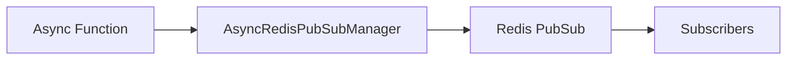

# PubSub - Publisher

## Description
Demonstrates publishing messages to Redis channels. Messages are broadcast to all subscribers of the channel.

## Code

```python
import asyncio
from wredis.async_api import AsyncRedisPubSubManager


async def main():
    manager = AsyncRedisPubSubManager(host="localhost")
    await manager.publish_message("channel_1", "Hello, Redis!")
    await manager.publish_message("channel_2", {"saludo": "Hola desde channel_2!"})


if __name__ == "__main__":
    asyncio.run(main())
```

## Run

```bash
python example.py
```

## Diagram


