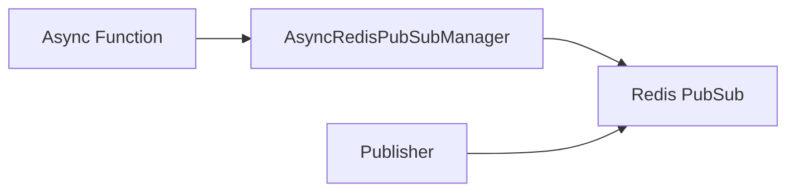

# PubSub - Subscriber

## Description
Demonstrates subscribing to Redis channels and handling incoming messages. Uses callbacks to process messages from subscribed channels.

## Code

```python
import asyncio
import signal
import sys
from wredis.async_api import AsyncRedisPubSubManager

manager = AsyncRedisPubSubManager(host="localhost", verbose=False)


@manager.on_message("channel_1")
def handle_message(message):
    print(f"[channel_1] Mensaje recibido: {message}")


@manager.on_message("channel_2")
def handle_channel_2(message):
    print(f"[channel_2] Mensaje recibido: {message}")


def signal_handler(sig, frame):
    print("\nDeteniendo programa...")
    sys.exit(0)


signal.signal(signal.SIGINT, signal_handler)

print("Listening... Press Ctrl+C to exit")
signal.pause()
```

## Run

```bash
python example.py
```

## Diagram

