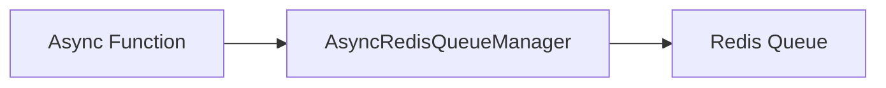

# Queue - Producer

## Description
Demonstrates publishing messages to Redis queues. Messages are pushed to queue lists with optional TTL.

## Code

```python
import asyncio
from wredis.async_api import AsyncRedisQueueManager


async def main():
    manager = AsyncRedisQueueManager(host="localhost")
    await manager.publish("tasks", {"task_id": 1, "description": "Process order"})
    await manager.publish("tasks", {"task_id": 2, "description": "Send email"}, ttl=60)
    await manager.publish("priority", {"task_id": 3, "priority": "high"})


if __name__ == "__main__":
    asyncio.run(main())
```

## Run

```bash
python example.py
```

## Diagram

