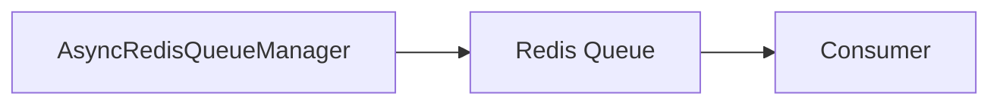

# Queue - Consumer

## Description
Demonstrates consuming messages from Redis queues. Uses callbacks to process messages from different queue channels.

## Code

```python
import asyncio
from wredis.async_api import AsyncRedisQueueManager

manager = AsyncRedisQueueManager(poll_interval=2, host="localhost", verbose=False)


@manager.on_message("tasks")
async def worker_tasks(record):
    print(f"Processing tasks: {record}")


@manager.on_message("priority")
async def worker_priority(record):
    print(f"Processing priority: {record}")


async def main():
    await manager.start()
    await manager.wait()


if __name__ == "__main__":
    asyncio.run(main())
```

## Run

```bash
python example.py
```

## Diagram


