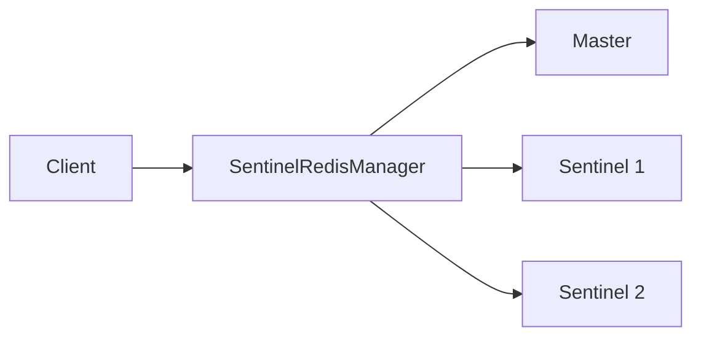

# Sentinel Redis Basic Example

## Description

This example demonstrates how to use the SentinelRedisManager to manage a Redis Sentinel setup. The SentinelRedisManager provides automatic failover and read/write separation by connecting to Sentinel nodes that monitor the Redis master and replicas.

## Architecture



## Code

```python
from wredis.ha import SentinelRedisManager

sentinel_nodes = [
    ("localhost", 26379),
    ("localhost", 26380),
    ("localhost", 26381),
]

manager = SentinelRedisManager(
    sentinel_nodes=sentinel_nodes,
    service_name="mymaster",
)

master = manager.get_master()
slave = manager.get_slave()

master.set("key", "value")
value = master.get("key")

print(f"Value from master: {value}")

if slave:
    slave_value = slave.get("key")
    print(f"Value from slave: {slave_value}")
```

## Run Instructions

1. Start Redis Sentinel nodes on ports 26379, 26380, and 26381
2. Ensure a Redis master and replica are running and configured with the Sentinel
3. Run the example:
   ```bash
   python example.py
   ```
