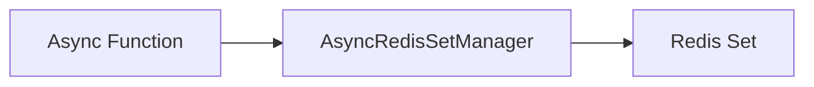

# Sets - Create

## Description
Demonstrates adding members to Redis sets. Sets store unique unordered elements with optional TTL.

## Code

```python
import asyncio
from wredis.async_api import AsyncRedisSetManager


async def main():
    manager = AsyncRedisSetManager(host="localhost")
    await manager.add_to_set("my_set", "value1", "value2", "value3")
    await manager.add_to_set("my_set", "value4", ttl=60)


if __name__ == "__main__":
    asyncio.run(main())
```

## Run

```bash
python example.py
```

## Diagram

