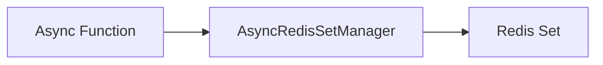

# Sets - Read

## Description
Demonstrates reading all members from a Redis set.

## Code

```python
import asyncio
from wredis.async_api import AsyncRedisSetManager


async def main():
    manager = AsyncRedisSetManager(host="localhost")
    members = await manager.get_set_members("my_set")
    print(f"Members: {members}")


if __name__ == "__main__":
    asyncio.run(main())
```

## Run

```bash
python example.py
```

## Diagram


