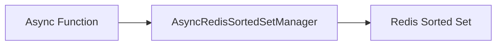

# Sorted Set - Create

## Description
Demonstrates adding members to Redis sorted sets with scores. Sorted sets maintain ordered elements by score.

## Code

```python
import asyncio
from wredis.async_api import AsyncRedisSortedSetManager


async def main():
    manager = AsyncRedisSortedSetManager(host="localhost")
    await manager.add_to_sorted_set("leaderboard", 100, "player1")
    await manager.add_to_sorted_set("leaderboard", 200, "player2")
    await manager.add_to_sorted_set("leaderboard", 150, "player3", ttl=60)


if __name__ == "__main__":
    asyncio.run(main())
```

## Run

```bash
python example.py
```

## Diagram

