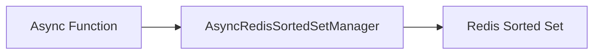

# Sorted Set - Read

## Description
Demonstrates reading members from a Redis sorted set, optionally with their scores.

## Code

```python
import asyncio
from wredis.async_api import AsyncRedisSortedSetManager


async def main():
    manager = AsyncRedisSortedSetManager(host="localhost")
    items = await manager.get_sorted_set("leaderboard", with_scores=True)
    print(f"Leaderboard: {items}")


if __name__ == "__main__":
    asyncio.run(main())
```

## Run

```bash
python example.py
```

## Diagram


