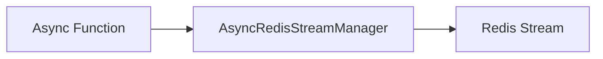

# Streams - Producer

## Description
Demonstrates producing messages to Redis streams. Streams are append-only log structures that support consumer groups.

## Code

```python
import asyncio
from wredis.async_api import AsyncRedisStreamManager


async def main():
    manager = AsyncRedisStreamManager(host="localhost")
    msg_id = await manager.add_to_stream("my_stream", {"event": "user_login", "user": "alice"})
    print(f"Message ID: {msg_id}")
    await manager.add_to_stream("my_stream", {"event": "user_logout", "user": "bob"})


if __name__ == "__main__":
    asyncio.run(main())
```

## Run

```bash
python example.py
```

## Diagram


