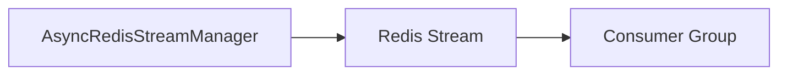

# Streams - Consumer

## Description
Demonstrates consuming messages from Redis streams using consumer groups for reliable message delivery.

## Code

```python
import asyncio
from wredis.async_api import AsyncRedisStreamManager

manager = AsyncRedisStreamManager(host="localhost", verbose=False)


@manager.on_message(stream_name="my_stream", group_name="my_group", consumer_name="consumer_1")
async def process_message(data):
    print(f"[Consumer 1] Processing: {data}")


async def main():
    await manager.start()
    await manager.wait()


if __name__ == "__main__":
    asyncio.run(main())
```

## Run

```bash
python example.py
```

## Diagram

