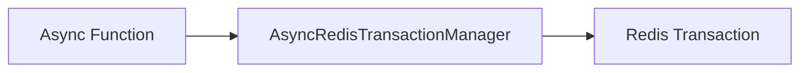

# Transaction - Basic

## Description
Demonstrates executing multiple Redis commands as a transaction. Transactions ensure atomic execution of all commands.

## Code

```python
import asyncio
from wredis.async_api import AsyncRedisTransactionManager


async def main():
    txn = AsyncRedisTransactionManager(host="localhost")
    results = await txn.execute_transaction(
        [
            ("set", ["balance:alice", "100"]),
            ("incrby", ["balance:alice", 50]),
            ("get", ["balance:alice"]),
        ]
    )
    print(f"Transaction results: {results}")


if __name__ == "__main__":
    asyncio.run(main())
```

## Run

```bash
python example.py
```

## Diagram

