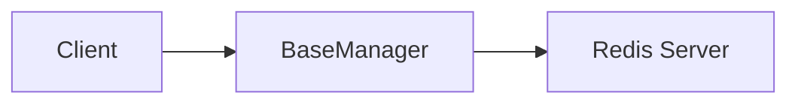

# 01 Basic Initialization

Quickly understand if this example fits your needs.



## What it does

Demonstrates how to create a BaseManager instance with default parameters and verify that the Redis connection works.

## When to use it

- Learning the basics of BaseManager
- Quick prototyping with default Redis settings
- Testing Redis connectivity

## Code

```python
# Copy and adapt to your needs
import redis
from wredis._base import BaseManager

# Create an instance with default configuration
manager = BaseManager()

# Replace the client with a real Redis client
manager.redis_client = redis.Redis(host="localhost", port=6379, db=0, decode_responses=True)

# Verify the connection
print(f"Redis client created: {type(manager.redis_client).__name__}")
print(f"Verbose mode enabled: {manager.verbose}")

# Perform a basic operation
manager.redis_client.set("example:01", "basic_initialization")
result = manager.redis_client.get("example:01")
print(f"Value stored and retrieved: {result}")

# Clean up resources
manager.close()
print("Connection closed successfully")
```

## Run it

```bash
python example.py
```

## Expected output

```
Redis client created: Redis
Verbose mode enabled: True
Value stored and retrieved: basic_initialization
Connection closed successfully
```
