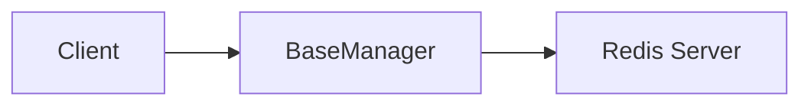

# 02 Custom Configuration

Quickly understand if this example fits your needs.



## What it does

Demonstrates how to initialize BaseManager with custom parameters for production environments, including host, port, database, timeout, and connection limits.

## When to use it

- Setting up production Redis connections
- Configuring connection timeouts
- Limiting maximum connections

## Code

```python
# Copy and adapt to your needs
import redis
from wredis._base import BaseManager

# Custom configuration for production environment
manager = BaseManager(
    host="localhost",
    port=6379,
    db=0,
    socket_timeout=10.0,
    max_connections=20,
    decode_responses=True,
    verbose=False,
)

# Use a real Redis client
manager.redis_client = redis.Redis(host="localhost", port=6379, db=0, decode_responses=True)

# Display configuration
print("BaseManager custom configuration:")
print(f"  Host: localhost")
print(f"  Port: 6379")
print(f"  Socket timeout: 10.0s")
print(f"  Max connections: 20")
print(f"  Verbose: {manager.verbose}")

# Verify it works
manager.redis_client.set("config:environment", "production")
value = manager.redis_client.get("config:environment")
print(f"Write/read test: {value}")

manager.close()
print("Connection closed successfully")
```

## Run it

```bash
python example.py
```

## Expected output

```
BaseManager custom configuration:
  Host: localhost
  Port: 6379
  Socket timeout: 10.0s
  Max connections: 20
  Verbose: False
Write/read test: production
Connection closed successfully
```