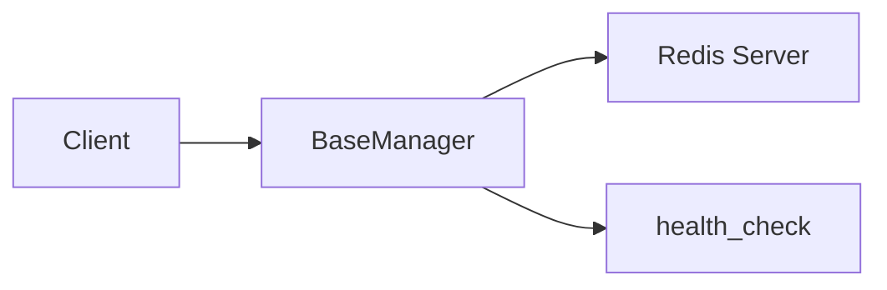

# 03 Health Check

Quickly understand if this example fits your needs.



## What it does

Demonstrates how to use the `health_check()` method to verify that the connection to Redis is active and working correctly.

## When to use it

- Monitoring Redis connectivity
- Verifying connections before operations
- Implementing connection reliability checks

## Code

```python
# Copy and adapt to your needs
import redis
from wredis._base import BaseManager

# Create the manager and configure a real Redis client
manager = BaseManager(verbose=False)
manager.redis_client = redis.Redis(host="localhost", port=6379, db=0, decode_responses=True)

# Check the connection status
print("=== Health Check Verification ===\n")

# health_check() returns True if connection is active
status = manager.health_check()
print(f"Connection status: {'ACTIVE' if status else 'INACTIVE'}")

# Simulate an operation
manager.redis_client.set("health:check", "ok")
value = manager.redis_client.get("health:check")
print(f"Operation test: {value}")

# health_check uses PING internally
ping_result = manager.redis_client.ping()
print(f"PING result: {ping_result}")

manager.close()
print("\nConnection closed successfully")
```

## Run it

```bash
python example.py
```

## Expected output

```
=== Health Check Verification ===

Connection status: ACTIVE
Operation test: ok
PING result: True

Connection closed successfully
```
