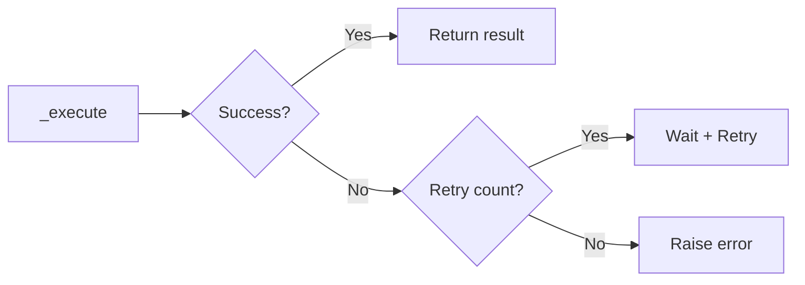

# 05 Execute with Retry

Quickly understand if this example fits your needs.



## What it does

Demonstrates the `_execute()` method that executes Redis operations with automatic retry logic using exponential backoff.

## When to use it

- Handling transient connection failures
- Building resilient applications
- Operations in unreliable networks

## Code

```python
# Copy and adapt to your needs
import redis
from wredis._base import BaseManager

print("=== Execution with Retries (_execute) ===\n")

with BaseManager(verbose=False) as manager:
    manager.redis_client = redis.Redis(host="localhost", port=6379, db=0, decode_responses=True)

    print("Executing operations with _execute():")

    # SET with retry
    result_set = manager._execute("set", "retry:key", "value_with_retry")
    print(f"  SET executed: {result_set}")

    # GET with retry
    result_get = manager._execute("get", "retry:key")
    print(f"  GET executed: {result_get}")

    # INCR with retry
    manager._execute("set", "retry:counter", "0")
    result_incr = manager._execute("incr", "retry:counter")
    print(f"  INCR executed: {result_incr}")

    # HSET with retry
    result_hset = manager._execute("hset", "retry:hash", mapping={"field1": "value1", "field2": "value2"})
    print(f"  HSET executed: {result_hset} fields")

    # HGETALL with retry
    result_hgetall = manager._execute("hgetall", "retry:hash")
    print(f"  HGETALL executed: {result_hgetall}")

print("\nAll operations executed with automatic retries")
```

## Run it

```bash
python example.py
```

## Expected output

```
=== Execution with Retries (_execute) ===

Executing operations with _execute():
  SET executed: True
  GET executed: value_with_retry
  INCR executed: 1
  HSET executed: 2
  HGETALL executed: {'field1': 'value1', 'field2': 'value2'}

All operations executed with automatic retries
```
