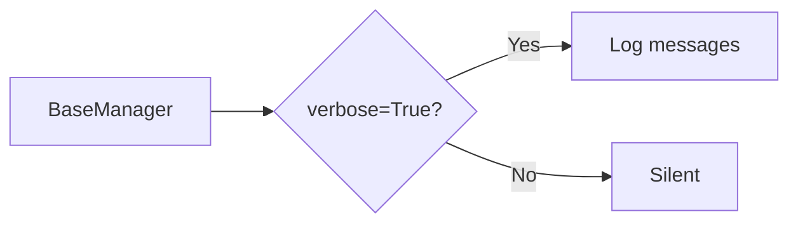

# 06 Logging

Quickly understand if this example fits your needs.



## What it does

Demonstrates the `log()` method for logging messages at different levels (debug, info, warning, error) using loguru when verbose mode is enabled.

## When to use it

- Debugging Redis operations
- Monitoring application behavior
- Production logging

## Code

```python
# Copy and adapt to your needs
import redis
from wredis._base import BaseManager

print("=== Integrated Logging System ===\n")

# Enable verbose mode for logging
manager = BaseManager(verbose=True)
manager.redis_client = redis.Redis(host="localhost", port=6379, db=responses=True)

print("Logging messages with different levels:\n")

manager.log("Initializing test operations", level="info")
manager.log("This is a debug message", level="debug")
manager.log("Warning: slow operation detected", level="warning")

# Perform operations while logging
manager.log("Executing SET", level="debug")
manager.redis_client.set("log:key", "log_value")
manager.log("SET completed successfully", level="info")

manager.log("Executing GET", level="debug")
value = manager.redis_client.get("log:key")
manager.log(f"GET completed - value: {value}", level="info")

# Disable verbose mode
print("\n--- Manager with verbose=False (no logging) ---")
silent_manager = BaseManager(verbose=False)
silent_manager.redis_client = redis.Redis(host="localhost", port=6379, db=0, decode_responses=True)
silent_manager.log("This message will NOT appear", level="error")
print("The previous message was not logged because verbose=False")

manager.close()
silent_manager.close()
print("\nConnections closed successfully")
```

## Run it

```bash
python example.py
```

## Expected output

```
=== Integrated Logging System ===

Logging messages with different levels:
...
2024-... | INFO | Initializing test operations
2024-... | DEBUG | This is a debug message
...
```

## Notes

- When verbose=False, log messages are suppressed
- Supported levels: debug, info, warning, error, critical
