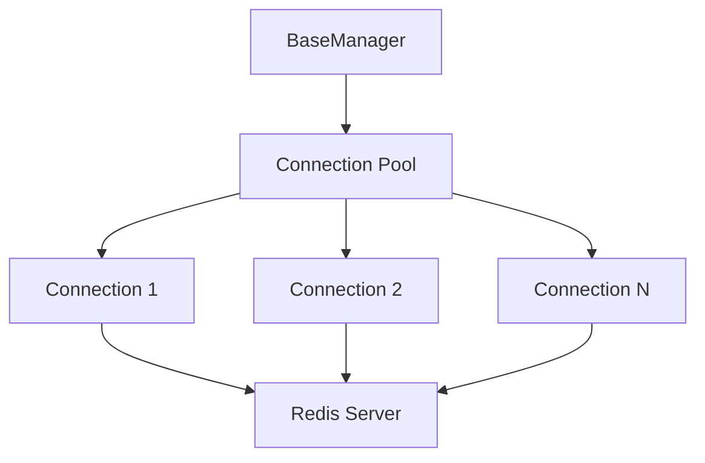

# 07 Connection Pooling

Quickly understand if this example fits your needs.



## What it does

Demonstrates how BaseManager internally manages a connection pool and how to configure the maximum number of connections.

## When to use it

- High-throughput applications
- Multi-threaded environments
- Connection limit management

## Code

```python
# Copy and adapt to your needs
import redis
from wredis._base import BaseManager

print("=== Connection Pool Management ===\n")

# Create manager with configured connection pool
manager = BaseManager(
    max_connections=5,
    decode_responses=True,
    verbose=False,
)

# Use a real Redis client
print(f"Connection pool created: {type(manager._pool).__name__}")
print(f"Maximum connections configured: {manager._pool.max_connections}")

# Configure the real Redis client
manager.redis_client = redis.Redis(host="localhost", port=6379, db=0, decode_responses=True)

# Verify operations work with the pool
print("\nExecuting operations with the connection pool:")

for i in range(3):
    manager._execute("set", f"pool:key:{i}", f"value_{i}")
    value = manager._execute("get", f"pool:key:{i}")
    print(f"  Operation {i + 1}: SET/GET of pool:key:{i} = {value}")

# Pool information
print(f"\nPool status:")
print(f"  Pool type: {type(manager._pool).__name__}")
print(f"  Max connections: {manager._pool.max_connections}")

manager.close()
print("\nConnection pool closed successfully")
```

## Run it

```bash
python example.py
```

## Expected output

```
=== Connection Pool Management ===

Connection pool created: ConnectionPool
Maximum connections configured: 5

Executing operations with the connection pool:
  Operation 1: SET/GET of pool:key:0 = value_0
  Operation 2: SET/GET of pool:key:1 = value_1
  Operation 3: SET/GET of pool:key:2 = value_2

Pool status:
  Pool type: ConnectionPool
  Max connections: 5

Connection pool closed successfully
```
