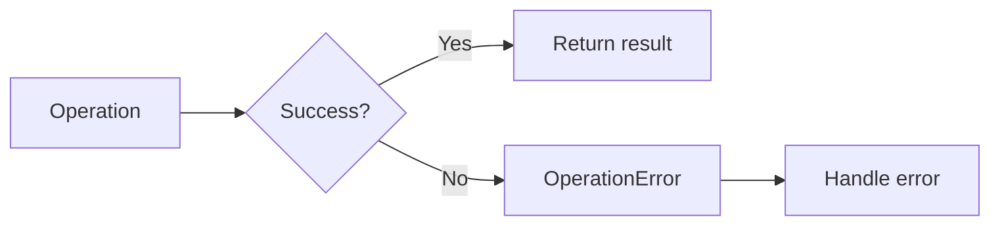

# 08 Error Handling

Quickly understand if this example fits your needs.



## What it does

Demonstrates how to handle connection errors and failed operations using wredis custom exceptions (`OperationError`).

## When to use it

- Building robust applications
- Graceful error recovery
- Custom error handling strategies

## Code

```python
# Copy and adapt to your needs
import redis
from wredis._base import BaseManager
from wredis._exceptions import OperationError

print("=== Error Handling ===\n")

# Create manager with a real Redis client
manager = BaseManager(verbose=False)
manager.redis_client = redis.Redis(host="localhost", port=6379, db=0, decode_responses=True)

# Scenario 1: Successful operation
print("1. Successful operation:")
try:
    result = manager._execute("set", "error:key", "value")
    print(f"   SET successful: {result}")
except OperationError as e:
    print(f"   Unexpected error: {e}")

# Scenario 2: Successful health check
print("\n2. Successful health check:")
try:
    status = manager.health_check()
    print(f"   Connection active: {status}")
except OperationError as e:
    print(f"   Health check failed: {e}")

# Scenario 3: Operation with invalid data
print("\n3. Structured error handling:")
try:
    manager._execute("get", "nonexistent_key")
    print("   GET on nonexistent key: None (expected behavior)")
except OperationError as e:
    print(f"   Operation error: {e}")

# Scenario 4: Safe closing
print("\n4. Safe connection closing:")
try:
    manager.close()
    print("   Connection closed without errors")
except Exception as e:
    print(f"   Error closing: {e}")

# Scenario 5: Context manager for automatic handling
print("\n5. Context manager for automatic handling:")
try:
    with BaseManager(verbose=False) as m:
        m.redis_client = redis.Redis(host="localhost", port=6379, db=0, decode_responses=True)
        m._execute("set", "context:error", "safe")
        print("   Operation within context: successful")
    print("   Resources automatically released")
except OperationError as e:
    print(f"   Error caught: {e}")

print("\nAll error handling scenarios completed")
```

## Run it

```bash
python example.py
```

## Expected output

```
=== Error Handling ===

1. Successful operation:
   SET successful: True

2. Successful health check:
   Connection active: True

3. Structured error handling:
   GET on nonexistent key: None (expected behavior)

4. Safe connection closing:
   Connection closed without errors

5. Context manager for automatic handling:
   Operation within context: successful
   Resources automatically released

All error handling scenarios completed
```