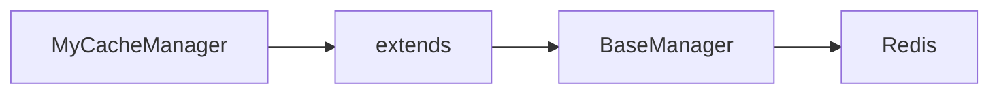

# 09 Custom Manager

Quickly understand if this example fits your needs.



## What it does

Demonstrates how to create a custom class that inherits from BaseManager to add application-specific functionality like cache management with prefixes and TTL.

## When to use it

- Building domain-specific managers
- Creating reusable cache layers
- Adding custom business logic

## Code

```python
# Copy and adapt to your needs
import redis
from wredis._base import BaseManager


class MyCacheManager(BaseManager):
    """Custom cache manager extending BaseManager."""

    def __init__(self, prefix: str = "cache", ttl: int = 300, **kwargs):
        """Initialize the cache manager."""
        super().__init__(**kwargs)
        self.prefix = prefix
        self.ttl = ttl

    def _full_key(self, key: str) -> str:
        """Generate full key with prefix."""
        return f"{self.prefix}:{key}"

    def store(self, key: str, value: str) -> bool:
        """Store a value in cache with TTL."""
        full_key = self._full_key(key)
        return self._execute("setex", full_key, self.ttl, value)

    def get(self, key: str) -> str | None:
        """Get a value from the cache."""
        full_key = self._full_key(key)
        return self._execute("get", full_key)

    def delete(self, key: str) -> bool:
        """Delete a value from the cache."""
        full_key = self._full_key(key)
        return bool(self._execute("delete", full_key))

    def stats(self) -> dict:
        """Get cache manager statistics."""
        return {
            "prefix": self.prefix,
            "ttl": self.ttl,
            "verbose": self.verbose,
            "pool_type": type(self._pool).__name__,
        }


# Demonstration
print("=== Custom Manager Extending BaseManager ===\n")

with MyCacheManager(prefix="myapp", ttl=600, verbose=False) as cache:
    cache.redis_client = redis.Redis(host="localhost", port=6379, db=0, decode_responses=True)

    # Display statistics
    stats = cache.stats()
    print("Manager statistics:")
    for key, value in stats.items():
        print(f"  {key}: {value}")

    # Store values
    print("\nStoring values in cache:")
    cache.store("user:1", '{"name": "Ana", "role": "admin"}')
    print("  User 1 stored")

    cache.store("user:2", '{"name": "Carlos", "role": "user"}')
    print("  User 2 stored")

    # Retrieve values
    print("\nRetrieving values from cache:")
    user1 = cache.get("user:1")
    print(f"  User 1: {user1}")

    user2 = cache.get("user:2")
    print(f"  User 2: {user2}")

    # Delete a value
    print("\nDeleting value:")
    cache.delete("user:1")
    user1_deleted = cache.get("user:1")
    print(f"  User 1 after deletion: {user1_deleted}")

print("\nCustom manager closed successfully")
```

## Run it

```bash
python example.py
```

## Expected output

```
=== Custom Manager Extending BaseManager ===

Manager statistics:
  prefix: myapp
  ttl: 600
  verbose: False
  pool_type: ConnectionPool

Storing values in cache:
  User 1 stored
  User 2 stored

Retrieving values from cache:
  User 1: {"name": "Ana", "role": "admin"}
  User 2: {"name": "Carlos", "role": "user"}

Deleting value:
  User 1 after deletion: None

Custom manager closed successfully
```
