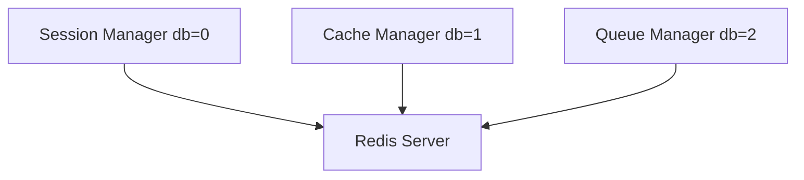

# 10 Multiple Instances

Quickly understand if this example fits your needs.



## What it does

Demonstrates how to create and manage multiple independent BaseManager instances connected to different Redis databases.

## When to use it

- Separating concerns (sessions, cache, queues)
- Multi-tenant applications
- Isolating data domains

## Code

```python
# Copy and adapt to your needs
import redis
from wredis._base import BaseManager

print("=== Multiple BaseManager Instances ===\n")

# Create three independent instances for different purposes
session_manager = BaseManager(db=0, verbose=False)
cache_manager = BaseManager(db=1, verbose=False)
queue_manager = BaseManager(db=2, verbose=False)

# Use real Redis clients for each database
session_manager.redis_client = redis.Redis(host="localhost", port=6379, db=0, decode_responses=True)
cache_manager.redis_client = redis.Redis(host="localhost", port=6379, db=1, decode_responses=True)
queue_manager.redis_client = redis.Redis(host="localhost", port=6379, db=2, decode_responses=True)

print("Instances created:")
print(f"  Sessions (db=0): {type(session_manager.redis_client).__name__}")
print(f"  Cache (db=1): {type(cache_manager.redis_client).__name__}")
print(f"  Queue (db=2): {type(queue_manager.redis_client).__name__}")

# Independent operations on each instance
print("\nOperations on each instance:")

# Session instance
session_manager._execute("set", "session:user:1", "token_abc123")
session = session_manager._execute("get", "session:user:1")
print(f"  Session - user:1 = {session}")

# Cache instance
cache_manager._execute("set", "cache:page:home", "<html>content</html>")
cache = cache_manager._execute("get", "cache:page:home")
print(f"  Cache - page:home = {cache[:30]}...")

# Queue instance
queue_manager._execute("lpush", "queue:tasks", "send_email")
queue_manager._execute("lpush", "queue:tasks", "generate_report")
task = queue_manager._execute("rpop", "queue:tasks")
print(f"  Queue - task processed = {task}")

# Verify independence
print("\nVerifying independence:")
print(f"  Session can see cache data: {session_manager._execute('get', 'cache:page:home')}")
print(f"  (Redis databases are independent)")

# Close all instances
session_manager.close()
cache_manager.close()
queue_manager.close()
print("\nAll instances closed successfully")
```

## Run it

```bash
python example.py
```

## Expected output

```
=== Multiple BaseManager Instances ===

Instances created:
  Sessions (db=0): Redis
  Cache (db=1): Redis
  Queue (db=2): Redis

Operations on each instance:
  Session - user:1 = token_abc123
  Cache - page:home = <html>content</html>...
  Queue - task processed = send_email

Verifying independence:
  Session can see cache data: None
  (Redis databases are independent)

All instances closed successfully
```
