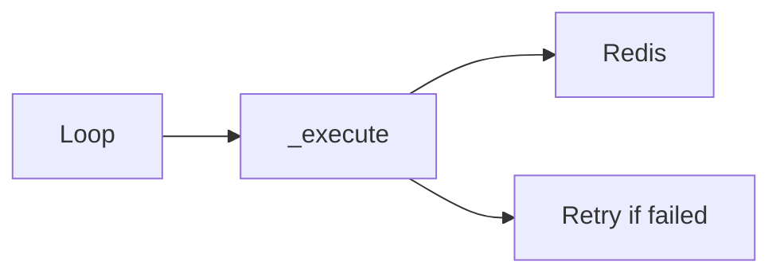

# 11 Batch Operations

Quickly understand if this example fits your needs.



## What it does

Demonstrates how to execute multiple Redis operations efficiently using the `_execute` method with automatic retries.

## When to use it

- Bulk data insertion
- Batch processing jobs
- Efficient data migration

## Code

```python
# Copy and adapt to your needs
import redis
from wredis._base import BaseManager

print("=== Batch Operations ===\n")

with BaseManager(verbose=False) as manager:
    manager.redis_client = redis.Redis(host="localhost", port=6379, db=0, decode_responses=True)

    # Batch 1: Bulk data insertion
    print("1. Bulk data insertion:")
    data = {
        "batch:product:1": '{"name": "Laptop", "price": 999.99}',
        "batch:product:2": '{"name": "Mouse", "price": 29.99}',
        "batch:product:3": '{"name": "Keyboard", "price": 79.99}',
        "batch:product:4": '{"name": "Monitor", "price": 349.99}',
        "batch:product:5": '{"name": "Webcam", "price": 59.99}',
    }

    for key, value in data.items():
        manager._execute("set", key, value)
    print(f"   {len(data)} products inserted")

    # Batch 2: Bulk reading
    print("\n2. Bulk data reading:")
    for key in data.keys():
        value = manager._execute("get", key)
        name = value.split('"name": "')[1].split('"')[0] if value else "N/A"
        print(f"   {key}: {name}")

    # Batch 3: List operations
    print("\n3. List operations:")
    tasks = ["process_order", "send_notification", "update_inventory", "generate_invoice"]
    for task in tasks:
        manager._execute("lpush", "batch:processing_queue", task)
    print(f"   {len(tasks)} tasks enqueued")

    length = manager._execute("llen", "batch:processing_queue")
    print(f"   Queue length: {length}")

    # Batch 4: Hash operations
    print("\n4. Hash operations:")
    manager._execute(
        "hset",
        "batch:config:app",
        mapping={
            "version": "2.5.0",
            "environment": "production",
            "debug": "false",
            "max_users": "1000",
        },
    )
    config = manager._execute("hgetall", "batch:config:app")
    print(f"   Configuration: {config}")

    # Batch 5: Set operations
    print("\n5. Set operations:")
    for user in ["ana", "carlos", "maria", "pedro", "ana"]:
        manager._execute("sadd", "batch:active_users", user)
    total = manager._execute("scard", "batch:active_users")
    print(f"   Unique active users: {total}")

print("\nAll batch operations completed")
```

## Run it

```bash
python example.py
```

## Expected output

```
=== Batch Operations ===

1. Bulk data insertion:
   5 products inserted

2. Bulk data reading:
   batch:product:1: Laptop
   batch:product:2: Mouse
   batch:product:3: Keyboard
   batch:product:4: Monitor
   batch:product:5: Webcam

3. List operations:
   4 tasks enqueued
   Queue length: 4

4. Hash operations:
   Configuration: {'version': '2.5.0', 'environment': 'production', 'debug': 'false', 'max_users': '1000'}

5. Set operations:
   Unique active users: 4

All batch operations completed
```
