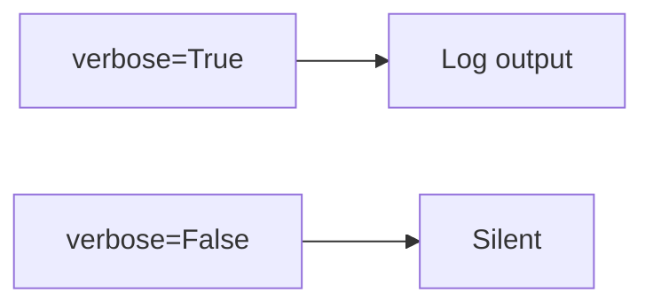

# 12 Verbose Mode

Quickly understand if this example fits your needs.



## What it does

Demonstrates the difference between running BaseManager with `verbose=True` and `verbose=False`, and how it affects operation logging.

## When to use it

- Development/debugging mode
- Production monitoring
- Dynamic logging control

## Code

```python
# Copy and adapt to your needs
import redis
from wredis._base import BaseManager

print("=== Verbose vs Silent Mode ===\n")

# Scenario 1: Manager with verbose=True
print("--- Scenario 1: verbose=True ---")
verbose_manager = BaseManager(verbose=True)
verbose_manager.redis_client = redis.Redis(host="localhost", port=6379, db=0, decode_responses=True)

print(f"Verbose status: {verbose_manager.verbose}")
verbose_manager.log("Operation started", level="info")
verbose_manager._execute("set", "verbose:key", "test_data")
verbose_manager.log("Data stored", level="info")
value = verbose_manager._execute("get", "verbose:key")
print(f"Value retrieved: {value}")

# Scenario 2: Manager with verbose=False
print("\n--- Scenario 2: verbose=False ---")
silent_manager = BaseManager(verbose=False)
silent_manager.redis_client = redis.Redis(host="localhost", port=6379, db=0, decode_responses=True)

print(f"Verbose status: {silent_manager.verbose}")
silent_manager.log("This operation is NOT logged", level="info")
silent_manager._execute("set", "silent:key", "test_data")
silent_manager.log("Data stored (without logging)", level="info")
value = silent_manager._execute("get", "silent:key")
print(f"Value retrieved: {value}")
print("(The previous log messages did not appear)")

# Scenario 3: Dynamic verbose switching
print("\n--- Scenario 3: Dynamic verbose switching ---")
dynamic_manager = BaseManager(verbose=False)
dynamic_manager.redis_client = redis.Redis(host="localhost", port=6379, db=0, decode_responses=True)

print(f"Initial verbose: {dynamic_manager.verbose}")
dynamic_manager.log("Message 1 (does not appear)", level="info")

# Switch to verbose=True
dynamic_manager.verbose = True
print(f"Verbose after change: {dynamic_manager.verbose}")
dynamic_manager.log("Message 2 (appears)", level="info")

# Switch back to verbose=False
dynamic_manager.verbose = False
print(f"Verbose after second change: {dynamic_manager.verbose}")
dynamic_manager.log("Message 3 (does not appear)", level="info")

verbose_manager.close()
silent_manager.close()
dynamic_manager.close()
print("\nAll connections closed successfully")
```

## Run it

```bash
python example.py
```

## Expected output

```
=== Verbose vs Silent Mode ===

--- Scenario 1: verbose=True ---
Verbose status: True
2024-... | INFO | Operation started
2024-... | INFO | Data stored
Value retrieved: test_data

--- Scenario 2: verbose=False ---
Verbose status: False
Value retrieved: test_data
(The previous log messages did not appear)

--- Scenario 3: Dynamic verbose switching ---
Initial verbose: False
Verbose after change: True
2024-... | INFO | Message 2 (appears)
Verbose after second change: False

All connections closed successfully
```
