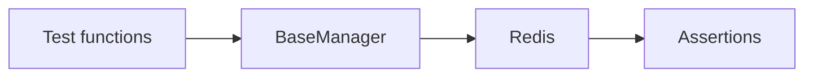

# 13 Unit Testing

Quickly understand if this example fits your needs.



## What it does

Demonstrates how to write unit tests for code that uses BaseManager, using real Redis for testing.

## When to use it

- Test-driven development
- CI/CD pipelines
- Integration testing

## Code

```python
# Copy and adapt to your needs
import redis
from wredis._base import BaseManager


def create_test_manager() -> BaseManager:
    """Create a manager configured for testing."""
    manager = BaseManager(verbose=False, decode_responses=True)
    manager.redis_client = redis.Redis(host="localhost", port=6379, db=0, decode_responses=True)
    return manager


def test_health_check():
    """Test that health_check returns True with active connection."""
    manager = create_test_manager()
    try:
        assert manager.health_check() is True
        print("  [PASS] test_health_check")
    finally:
        manager.close()


def test_set_get():
    """Test basic SET and GET operations."""
    manager = create_test_manager()
    try:
        manager._execute("set", "test:key", "test_value")
        result = manager._execute("get", "test:key")
        assert result == "test_value"
        print("  [PASS] test_set_get")
    finally:
        manager.close()


def test_delete():
    """Test DELETE operation."""
    manager = create_test_manager()
    try:
        manager._execute("set", "test:delete", "temporary")
        assert manager._execute("get", "test:delete") == "temporary"
        manager._execute("delete", "test:delete")
        assert manager._execute("get", "test:delete") is None
        print("  [PASS] test_delete")
    finally:
        manager.close()


def test_list_operations():
    """Test list operations."""
    manager = create_test_manager()
    try:
        manager._execute("lpush", "test:list", "elem1", "elem2", "elem3")
        length = manager._execute("llen", "test:list")
        assert length == 3
        element = manager._execute("rpop", "test:list")
        assert element == "elem1"
        print("  [PASS] test_list_operations")
    finally:
        manager.close()


def test_hash_operations():
    """Test hash operations."""
    manager = create_test_manager()
    try:
        manager._execute("hset", "test:hash", mapping={"field1": "value1", "field2": "value2"})
        value = manager._execute("hget", "test:hash", "field1")
        assert value == "value1"
        all_values = manager._execute("hgetall", "test:hash")
        assert len(all_values) == 2
        print("  [PASS] test_hash_operations")
    finally:
        manager.close()


def test_context_manager():
    """Test that the context manager works correctly."""
    with BaseManager(verbose=False) as manager:
        manager.redis_client = redis.Redis(host="localhost", port=6379, db=0, decode_responses=True)
        manager._execute("set", "test:context", "ok")
        assert manager._execute("get", "test:context") == "ok"
    print("  [PASS] test_context_manager")


def test_verbose_mode():
    """Test that verbose mode controls logging."""
    manager = BaseManager(verbose=False)
    manager.redis_client = redis.Redis(host="localhost", port=6379, db=0, decode_responses=True)
    assert manager.verbose is False
    manager.log("test message", level="debug")
    manager.close()
    print("  [PASS] test_verbose_mode")


# Run all tests
print("=== Unit Tests with BaseManager ===\n")
print("Running tests:\n")

test_health_check()
test_set_get()
test_delete()
test_list_operations()
test_hash_operations()
test_context_manager()
test_verbose_mode()

print("\nAll tests passed successfully")
```

## Run it

```bash
python example.py
```

## Expected output

```
=== Unit Tests with BaseManager ===

Running tests:

  [PASS] test_health_check
  [PASS] test_set_get
  [PASS] test_delete
  [PASS] test_list_operations
  [PASS] test_hash_operations
  [PASS] test_context_manager
  [PASS] test_verbose_mode

All tests passed successfully
```
