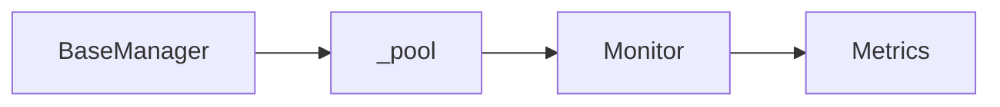

# 15 Connection Pool Monitoring

Quickly understand if this example fits your needs.



## What it does

Demonstrates how to monitor and get information about the status of the Redis connection pool managed by BaseManager.

## When to use it

- Performance optimization
- Capacity planning
- Troubleshooting connection issues

## Code

```python
# Copy and adapt to your needs
import redis
from wredis._base import BaseManager

print("=== Connection Pool Monitoring ===\n")

# Create manager with specific configuration for monitoring
manager = BaseManager(
    max_connections=10,
    socket_timeout=5.0,
    verbose=False,
)

# Use a real Redis client
manager.redis_client = redis.Redis(host="localhost", port=6379, db=0, decode_responses=True)

# Pool information
print("1. Pool information:")
print(f"   Type: {type(manager._pool).__name__}")
print(f"   Max connections: {manager._pool.max_connections}")
print(f"   Configured host: {manager._pool.connection_kwargs.get('host', 'localhost')}")
print(f"   Configured port: {manager._pool.connection_kwargs.get('port', 6379)}")
print(f"   Database: {manager._pool.connection_kwargs.get('db', 0)}")
print(f"   Timeout: {manager._pool.connection_kwargs.get('socket_timeout', 5.0)}s")

# Perform operations and monitor
print("\n2. Monitoring during operations:")
for i in range(3):
    manager._execute("set", f"monitor:key:{i}", f"value_{i}")
    value = manager._execute("get", f"monitor:key:{i}")
    print(f"   Operation {i + 1}: {value}")

# Status after operations
print("\n3. Pool status after operations:")
print(f"   Max connections: {manager._pool.max_connections}")

# Client information
print("\n4. Redis client information:")
print(f"   Client type: {type(manager.redis_client).__name__}")
print(
    f"   Decode responses: {manager.redis_client.connection_pool.connection_kwargs.get('decode_responses', False)}"
)

# Health check
print("\n5. Health check:")
status = manager.health_check()
print(f"   Status: {'ACTIVE' if status else 'INACTIVE'}")

# Simulated metrics monitoring
print("\n6. Simulated metrics:")
metrics = {
    "max_connections": manager._pool.max_connections,
    "connection_status": "active" if manager.health_check() else "inactive",
    "socket_timeout": f"{manager._pool.connection_kwargs.get('socket_timeout', 5.0)}s",
    "successful_operations": 6,
    "failed_operations": 0,
}
for metric, value in metrics.items():
    print(f"   {metric}: {value}")

# Close and verify
manager.close()
print("\n7. After closing:")
print("   Pool disconnected successfully")
print("   Monitoring completed")
```

## Run it

```bash
python example.py
```

## Expected output

```
=== Connection Pool Monitoring ===

1. Pool information:
   Type: ConnectionPool
   Max connections: 10
   Configured host: localhost
   Configured port: 6379
   Database: 0
   Timeout: 5.0s

2. Monitoring during operations:
   Operation 1: value_0
   Operation 2: value_1
   Operation 3: value_2

3. Pool status after operations:
   Max connections: 10

4. Redis client information:
   Client type: Redis
   Decode responses: True

5. Health check:
   Status: ACTIVE

6. Simulated metrics:
   max_connections: 10
   connection_status: active
   socket_timeout: 5.0s
   successful_operations: 6
   failed_operations: 0

7. After closing:
   Pool disconnected successfully
   Monitoring completed
```