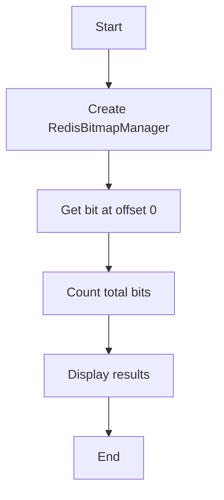

# Bitmap Read Example

## Description

This example demonstrates how to read data from a Redis bitmap using the `RedisBitmapManager`. It shows how to get a specific bit value and count the total number of set bits in a bitmap.

## Diagram



## Code

```python
from wredis.bitmap import RedisBitmapManager

bitmap_manager = RedisBitmapManager(host="localhost")

print(bitmap_manager.get_bit("my_bitmap", 0))
print(bitmap_manager.count_bits("my_bitmap"))
```

## Run Instructions

```bash
python example.py
```

Make sure Redis is running on localhost and you have some bitmap data set.
