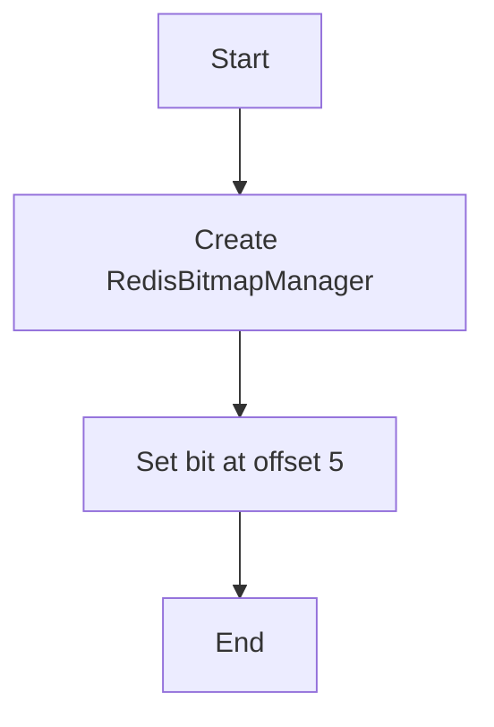

# Bitmap Create Example

## Description

This example demonstrates how to create a bitmap and set a bit value using the `RedisBitmapManager`.

## Diagram



## Code

```python
from wredis.bitmap import RedisBitmapManager

bitmap_manager = RedisBitmapManager(host="localhost")

bitmap_manager.set_bit(key="my_bitmap", offset=5, value=1)
```

## Run Instructions

```bash
python example.py
```

Make sure Redis is running on localhost.
