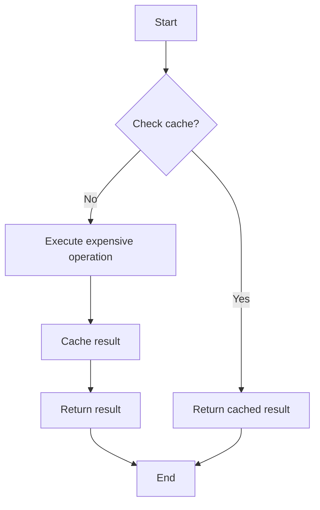

# Cache Basic Example

## Description

This example demonstrates how to use the cache decorator from WRedis. The decorator caches function results in Redis, making subsequent calls with the same arguments return instantly.

## Diagram



## Code

```python
"""Cache Decorator Example - Basic"""

import time
from wredis.decorators import cache


@cache(ttl=60, prefix="myapp")
def expensive_operation(x, y):
    """This function only runs if result is not cached."""
    time.sleep(2)  # Simulate expensive computation
    return x + y


if __name__ == "__main__":
    # First call - will be slow (2 seconds)
    start = time.time()
    result1 = expensive_operation(10, 20)
    print(f"First call: {result1} (took {time.time() - start:.2f}s)")

    # Second call - will be fast (from cache)
    start = time.time()
    result2 = expensive_operation(10, 20)
    print(f"Second call: {result2} (took {time.time() - start:.2f}s)")
```

## Run Instructions

```bash
python example.py
```

The first call will take ~2 seconds, the second call will be nearly instant.
