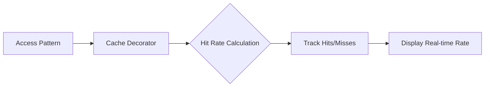

# 02 Hit Rate Monitoring

Quickly understand if this example fits your needs.



## What it does

Demonstrates how to monitor cache hit rate over time using different access patterns with the CacheMetrics property.

## When to use it

- When you need to track cache effectiveness over time
- When analyzing access patterns in production
- When setting performance benchmarks

## Code

```python
# Copy and adapt to your needs
import redis
from wredis.decorators import cache, CacheMetrics

redis_client = redis.Redis(host="localhost", port=6379, db=0, decode_responses=True)
metrics = CacheMetrics()


@cache(ttl=600, prefix="producto", redis_client=redis_client, metrics=metrics)
def obtener_producto(producto_id: int) -> dict:
    """Simulates a product catalog query."""
    return {"id": producto_id, "nombre": f"Producto_{producto_id}", "precio": producto_id * 10.5}


# Simulate access pattern: some repeated, some unique
patron_acceso = [1, 2, 1, 3, 1, 2, 4, 1, 5, 1]

for i, pid in enumerate(patron_acceso, 1):
    resultado = obtener_producto(pid)
    print(f"Access #{i}: producto_id={pid} -> {resultado['nombre']}")
    print(f"  Current hit rate: {metrics.hit_rate:.1f}%")

print()
print("=== Final Summary ===")
print(f"Total hits: {metrics.hits}")
print(f"Total misses: {metrics.misses}")
print(f"Total errors: {metrics.errors}")
print(f"Hit rate: {metrics.hit_rate:.1f}%")

redis_client.close()
```

## Run it

```bash
python example.py
```

## Expected output

Shows real-time hit rate updates as different products are accessed, with final summary showing approximately 50% hit rate.
