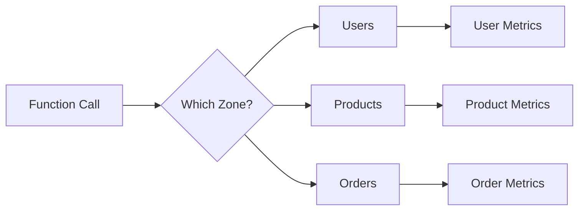

# 03 Multiple Cache Zones

Quickly understand if this example fits your needs.



## What it does

Demonstrates using independent CacheMetrics instances to track separate cache zones for different data types.

## When to use it

- When you have multiple independent cache zones
- When you need per-zone performance metrics
- When different data types have different caching needs

## Code

```python
# Copy and adapt to your needs
import redis
from wredis.decorators import cache, CacheMetrics

redis_client = redis.Redis(host="localhost", port=6379, db=0, decode_responses=True)

# Create separate metrics for each cache zone
metrics_usuarios = CacheMetrics()
metrics_productos = CacheMetrics()
metrics_pedidos = CacheMetrics()


@cache(ttl=300, prefix="usuarios", redis_client=redis_client, metrics=metrics_usuarios)
def obtener_usuario(user_id: int) -> dict:
    """Simulated user table query."""
    return {"id": user_id, "nombre": f"User_{user_id}"}


@cache(ttl=300, prefix="productos", redis_client=redis_client, metrics=metrics_productos)
def obtener_producto(prod_id: int) -> dict:
    """Simulated products table query."""
    return {"id": prod_id, "nombre": f"Prod_{prod_id}"}


@cache(ttl=300, prefix="pedidos", redis_client=redis_client, metrics=metrics_pedidos)
def obtener_pedido(order_id: int) -> dict:
    """Simulated orders table query."""
    return {"id": order_id, "total": order_id * 25.0}


# Access each cache zone
print("=== Users Zone ===")
obtener_usuario(1)  # miss
obtener_usuario(1)  # hit
obtener_usuario(2)  # miss

print("\n=== Products Zone ===")
obtener_producto(10)  # miss
obtener_producto(10)  # hit
obtener_producto(10)  # hit
obtener_producto(11)  # miss

print("\n=== Orders Zone ===")
obtener_pedido(100)  # miss
obtener_pedido(100)  # hit

# Zone comparison
print("\n=== Zone Comparison ===")
for nombre, m in [("Users", metrics_usuarios), ("Products", metrics_productos), ("Orders", metrics_pedidos)]:
    print(f"{nombre}: hits={m.hits}, misses={m.misses}, hit_rate={m.hit_rate:.1f}%")

redis_client.close()
```

## Run it

```bash
python example.py
```

## Expected output

Shows independent metrics for each zone with comparative summary table.