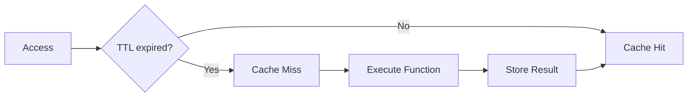

# 04 TTL Impact

Quickly understand if this example fits your needs.



## What it does

Compares cache performance between short and long TTL values, demonstrating how TTL affects hit rate over time.

## When to use it

- When tuning cache TTL for your application
- When analyzing the impact of TTL on cache effectiveness
- When deciding on TTL values for different data types

## Code

```python
# Copy and adapt to your needs
import time
import redis
from wredis.decorators import cache, CacheMetrics

# Short TTL scenario
redis_corto = redis.Redis(host="localhost", port=6379, db=0, decode_responses=True)
metrics_corto = CacheMetrics()

@cache(ttl=1, prefix="datos_cortos", redis_client=redis_corto, metrics=metrics_corto)
def consulta_corta(query_id: int) -> dict:
    return {"query": query_id, "resultado": "datos_procesados"}

# Long TTL scenario
redis_largo = redis.Redis(host="localhost", port=6379, db=0, decode_responses=True)
metrics_largo = CacheMetrics()

@cache(ttl=10, prefix="datos_largos", redis_client=redis_largo, metrics=metrics_largo)
def consulta_larga(query_id: int) -> dict:
    return {"query": query_id, "resultado": "datos_procesados"}

print("=== Short TTL (1 second) ===")
for i in range(5):
    consulta_corta(1)
    print(f"  Access {i + 1}: hits={metrics_corto.hits}, misses={metrics_corto.misses}")
    time.sleep(1.1)

print(f"Final hit rate: {metrics_corto.hit_rate:.1f}%")

print("\n=== Long TTL (10 seconds) ===")
for i in range(5):
    consulta_larga(1)
    print(f"  Access {i + 1}: hits={metrics_largo.hits}, misses={metrics_largo.misses}")
    time.sleep(0.5)

print(f"Final hit rate: {metrics_largo.hit_rate:.1f}%")

print("\n=== Comparison ===")
print(f"Short TTL -> Hit rate: {metrics_corto.hit_rate:.1f}%")
print(f"Long TTL -> Hit rate: {metrics_largo.hit_rate:.1f}%")

redis_corto.close()
redis_largo.close()
```

## Run it

```bash
python example.py
```

## Expected output

Shows that short TTL results in 0% hit rate (expired between calls) while long TTL maintains high hit rate.