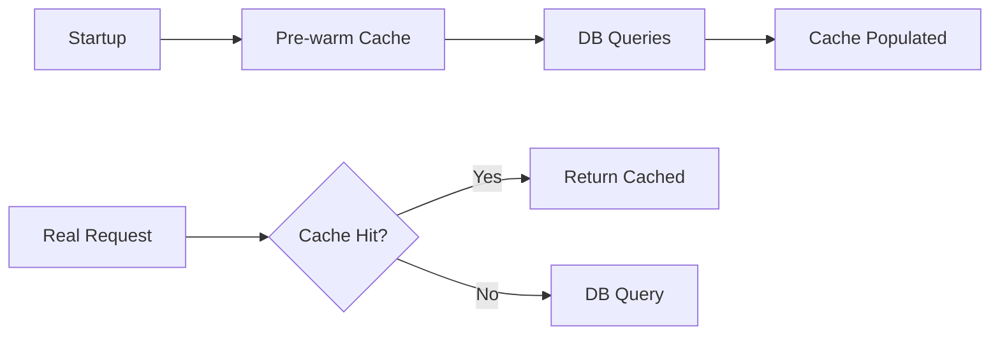

# 05 Cache Warming

Quickly understand if this example fits your needs.



## What it does

Demonstrates pre-warming the cache with frequently accessed data to improve hit rates from the start.

## When to use it

- When your application has known frequently accessed data
- During application startup or after deployment
- When preparing for high-traffic periods

## Code

```python
# Copy and adapt to your needs
import redis
from wredis.decorators import cache, CacheMetrics

redis_client = redis.Redis(host="localhost", port=6379, db=0, decode_responses=True)
metrics = CacheMetrics()


@cache(ttl=600, prefix="config", redis_client=redis_client, metrics=metrics)
def cargar_configuracion(clave: str) -> dict:
    """Simulates loading configuration from database."""
    print(f"  [DB] Loading configuration: {clave}")
    return {"clave": clave, "valor": f"valor_para_{clave}"}


# Pre-warm cache with common keys
print("=== Pre-warming cache ===")
claves_comunes = ["theme", "language", "timezone", "notifications", "layout"]
for clave in claves_comunes:
    cargar_configuracion(clave)

print(f"Metrics after pre-warming: {metrics}")

# Simulate real traffic matching pre-warmed keys
print("\n=== Real traffic ===")
solicitudes_reales = ["theme", "language", "theme", "notifications", "theme", "layout"]
for clave in solicitudes_reales:
    resultado = cargar_configuracion(clave)
    print(f"  Request '{clave}' -> {resultado['valor']}")

print(f"\nFinal metrics: {metrics}")
print(f"Final hit rate: {metrics.hit_rate:.1f}%")

redis_client.close()
```

## Run it

```bash
python example.py
```

## Expected output

Shows pre-warming phase followed by high hit rate on real traffic (83.3% in this case).