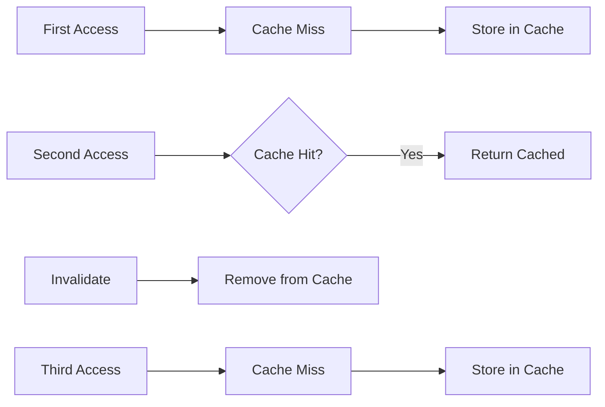

# 06 Invalidation Impact

Quickly understand if this example fits your needs.



## What it does

Shows how cache invalidation affects metrics and creates cache misses even for previously cached data.

## When to use it

- When tracking the impact of manual cache invalidation
- When analyzing why hit rate drops after data updates
- When implementing cache invalidation strategies

## Code

```python
# Copy and adapt to your needs
import redis
from wredis.decorators import cache, CacheMetrics

redis_client = redis.Redis(host="localhost", port=6379, db=0, decode_responses=True)
metrics = CacheMetrics()


@cache(ttl=600, prefix="session", redis_client=redis_client, metrics=metrics)
def obtener_sesion(session_id: str) -> dict:
    """Gets user session data."""
    return {"session_id": session_id, "datos": "datos_de_sesion"}


def invalidar_sesion(session_id: str) -> None:
    """Invalidates a specific session in cache."""
    patron = f"session:*"
    claves = redis_client.keys(patron)
    for clave in claves:
        valor = redis_client.get(clave)
        if session_id.encode() in valor:
            redis_client.delete(clave)
            print(f"  [Invalidated] session: {session_id}")
            break


# Normal flow: miss -> hit -> hit
print("=== Normal flow ===")
obtener_sesion("abc123")  # miss
obtener_sesion("abc123")  # hit

print("\n=== Invalidating session ===")
invalidar_sesion("abc123")

print("\n=== After invalidation ===")
obtener_sesion("abc123")  # miss
obtener_sesion("abc123")  # hit

print(f"\n=== Summary ===")
print(f"Hits: {metrics.hits}")
print(f"Misses: {metrics.misses}")
print(f"Hit rate: {metrics.hit_rate:.1f}%")

redis_client.close()
```

## Run it

```bash
python example.py
```

## Expected output

Shows hit rate dropping after invalidation, then recovering as cache is repopulated.
